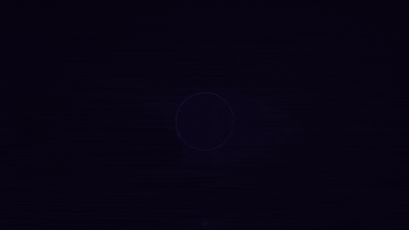
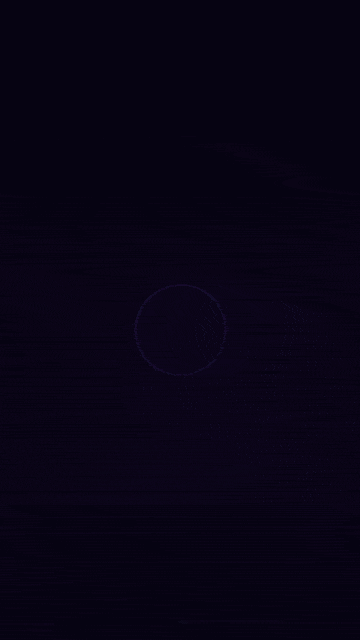
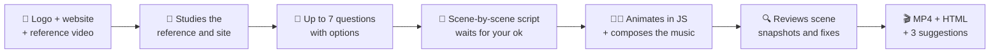

<div align="center">

[🇧🇷 Português](README.md) · **🇺🇸 English**

# 🎬 JSmotion-skill

### Studio-quality brand videos, made by Claude, in **one conversation**.

**No After Effects. No Premiere. No generic templates. No editor.**<br>
Send your logo and website — Claude studies them, asks a few questions, writes the script, animates it in JavaScript, composes the soundtrack and hands you a **ready-to-post MP4**.

[](#-install-in-1-minute)
[](references/engine.md)
[](references/engine.md)
[](scripts/render.py)
[](LICENSE)

[](https://github.com/flavioduque/Jsmotion-skill/stargazers)
[](https://github.com/flavioduque/Jsmotion-skill/network/members)

<br>

&nbsp;

<sub>🤯 <b>These GIFs were made by jsmotion itself</b> — same engine, same code, <b>16:9 and 9:16</b>. ▶️ With sound: <a href="docs/demo-en.mp4">MP4 16:9</a> · <a href="docs/demo-vertical-en.mp4">MP4 9:16</a> · <a href="examples/promo">🧑‍💻 See the code</a></sub>

<br><br>

**[⚡ Install](#-install-in-1-minute)** · **[🎥 How it works](#-how-it-works)** · **[✨ Features](#-what-makes-it-look-studio-made)** · **[🧠 Under the hood](#-under-the-hood)** · **[❓ FAQ](#-faq)**

</div>

---

## 💥 In one sentence

> **You say:** *"Make me a jsmotion video for my brand, website www.mycompany.com"* — and attach your logo.
>
> **Claude delivers:** a **pack of 1080p MP4s with music and sound effects — 9:16, 1:1 and 16:9 of the same video** —, backup **.html** files with a *"Download MP4"* button, and **3 suggestions** to make the next one even better.

One conversation. Zero timeline. Zero manual keyframes.


<sub>👆 Real frames from a 25s 9:16 video the skill made for <a href="https://www.constructiva.dev">Constructiva.dev</a> (Spanish copy) — from hook to call to action.</sub>

---

## 🤯 Why this changes the game

| | 🧑‍🎨 Agency / freelancer | 🧩 Online template | 🎬 **jsmotion** |
|---|:---:|:---:|:---:|
| Time to first video | days or weeks | hours | **one conversation** |
| Studies your site and pulls colors/projects | ✅ | ❌ | ✅ **automatic** |
| Copies the style of a reference video | ✅ | ❌ | ✅ **automatic** |
| Soundtrack synced to every word | sometimes | ❌ | ✅ **generated in code** |
| Same animation in 9:16, 1:1, 4:5 and 16:9 | 💸 extra fee | partial | ✅ **one request, every format** |
| You own the video's "source code" | ❌ | ❌ | ✅ **open, editable JS** |
| Platform-standard loudness (−14 LUFS) | ✅ | ❌ | ✅ **mastered at render** |
| Cost of a new version | 💸💸💸 | subscription | **one message** |

---

## ⚡ Install in 1 minute

### Option A — claude.ai (recommended, no terminal)

1. Download [`dist/jsmotion.skill`](dist/jsmotion.skill) *(or the file from the latest [release](https://github.com/flavioduque/Jsmotion-skill/releases))*.
2. On claude.ai: **Settings → Capabilities → Skills → `+`** and upload the file.
3. Turn on **"Code execution and file creation"**.

Done. ✅

### Option B — Claude Code

```bash
git clone https://github.com/flavioduque/Jsmotion-skill.git ~/.claude/skills/jsmotion
```

> [!NOTE]
> The skill was designed for the claude.ai environment (`/home/claude` and `/mnt/user-data/outputs` folders). It also works in Claude Code — Claude uses your working folder instead. You need **Python 3**, **ffmpeg** and **Chromium/Playwright** (`install_watch.sh` installs whatever is missing). Already have Chromium? Point to it with `CHROMIUM_PATH=/path/to/chrome`. Files go to `./jsmotion-work` (work) and `./jsmotion-out` (deliverables) — or wherever you point `JSMOTION_WORKDIR` and `JSMOTION_OUTDIR`.

> [!TIP]
> The skill's instructions are written in Portuguese, but **Claude talks to you in your language** and writes the on-screen copy in whatever language you ask for.

---

## 🚀 Usage

Attach **your logo** (and, optionally, a **reference video** you love) and write:

```text
Make me a jsmotion video for my brand X, website www.example.com
```

It also works without saying "jsmotion": *"make an animated video of my company for Reels"*, *"I want a motion video with my logo"*, *"make something like this video"*…

---

## 🎥 How it works



<details open>
<summary><b>1 · Research before asking</b></summary>

- **Reference video:** uses the [watch](https://github.com/taoufik123-collab/claude-watch) skill to extract frames into a contact sheet. Notes the palette, pacing, how text enters, transitions and the element that guides the eye.
- **Brand website:** downloads HTML + JS/CSS, ranks the **most-used colors**, grabs the title and **downloads images and videos** — even from SPA sites (React/Vite), where media lives inside the bundle.
- **Logo:** uses the **original** file. Never redraws it — only trims transparent margins and resizes.
</details>

<details open>
<summary><b>2 · Few questions, all multiple-choice</b></summary>

At most **7 questions, one at a time**, each with 3 options + *"I don't know, you choose"* + Claude's recommendation:

| # | Question | Example options |
|---|---|---|
| 1 | **Where you'll post** | **pack 9:16 + 1:1 + 16:9** · 9:16 only · another combination (4:5, 1:1, 16:9) |
| 2 | **Length** | 15s · 25s · 40s — or **any value from 6 to 90s** |
| 3 | **Style** | your reference's style in your colors · + 2 other moods |
| 4 | **Hook (first 3 seconds)** | provocative question · bold statement · promise of results |
| 5 | **Guiding element** | spark of light · light ring · self-drawing line |
| 6 | **Sound** | soft electronic · epic and deep · minimal |
| 7 | **Call to action** | 3 CTAs — recommends the one that "closes" the hook |

If the answer is already in the conversation, the question is skipped.
</details>

<details open>
<summary><b>3 · Script before code</b></summary>

Scene by scene, with timings, exact copy, what moves and the sound. The structure follows a retention curve:

```text
hook ~12% │ twist ~12% │ services ~20% │ proof/projects ~34% │ promise ~12% │ logo + CTA 2.5s
```
</details>

<details open>
<summary><b>4 · Produce, review, deliver</b></summary>

- Animates everything on a single `<canvas>`, composes the soundtrack and packs the assets into a **single HTML file that works offline**.
- Takes **15–18 snapshots** (including mid-transitions) and hunts for leaking text, overlaps, text too close to the edge, altered logos, empty scenes — fixes and reviews again.
- Renders **frame by frame** in headless Chromium → **MP4 H.264 (CRF 17) + AAC 192k**, **all formats in parallel**.
- **Masters the audio to −14 LUFS** (the loudness Instagram, TikTok and YouTube use), true peak below −1.5 dBTP, and delivers.
</details>

---

## ✨ What makes it look studio-made

Mandatory rules in every video:

- 🎯 **A hook in the first 3 seconds** — what stops the scroll.
- 🥁 **Something happens every half second** — everything pulses at 120 BPM: rings, sparks, entrances.
- ✍️ **Word-by-word text** with blur + scale, and the **key word highlighted** (gradient + glow).
- ✨ **A guiding element** from start to finish — the spark "lights up" each screen as it enters.
- 🌊 **Zero hard cuts** — only light flashes, zooms or liquid waves.
- 🌌 **A background with depth** — gradient, soft lights, particles, grain and vignette.
- 🪟 **Glass screens** — windows with browser bars, passing reflections and glowing borders.
- 🔊 **Sound that "sees" the picture** — every word gets a sparkle, every transition a whoosh, every key moment a deep hit.
- 🏁 **A fixed 2.5s ending** with the original logo + call to action.

---

## 📐 Formats

| Format | Resolution | Where to use | Layout |
|---|---|---|---|
| 📱 Vertical 9:16 | 1080×1920 | Reels · TikTok · Shorts · Stories | the original design |
| 🖼️ Portrait 4:5 | 1080×1350 | Instagram/Facebook feed | stacked, scaled into the safe area |
| ⬛ Square 1:1 | 1080×1080 | Feed · LinkedIn | stacked, scaled into the safe area |
| 🖥️ Landscape 16:9 | 1920×1080 | YouTube · website · presentations | media on the left, text on the right |

**One codebase, every format:** scenes are drawn once and a "stage" fits each block (media, text, full screen) into the chosen format. The 9:16 output is pixel-identical to the design. Always **30 fps**. The 9:16 safe area avoids the apps' UI (top and bottom) — your text never hides behind the like button.

---

## 🧠 Under the hood

<details>
<summary><b>Why canvas + JavaScript instead of a video editor?</b></summary>

<br>

Every frame is a **pure function of time**: `render(ctx, t)`. That gives you superpowers:

- **Deterministic** — no stray `Math.random()`; everything uses `rng(seed)`. The video comes out **identical** on every render.
- **Exact rendering** — `render.py` asks headless Chromium for each frame at `t = f / 30` and pipes it straight into ffmpeg. No dropped frames, no stutter, regardless of machine speed.
- **Editable as code** — changing a color, a line of copy or a timing is a one-line change.

Per-frame order:

```text
drawBackground → scenes (scene1..6) → drawSpark (guide) → transitions → drawNoise → fade-in
```
</details>

<details>
<summary><b>How does the soundtrack stay in sync with the picture?</b></summary>

<br>

Picture and sound read the **same timeline**:

```js
const WORDS  = [...];              // every word that enters → a sparkle sound
const WH     = [2.7, 5.7, 10.75];  // whooshes (played 0.35s before each transition)
const IMPACT = [3.0, 22.6];        // deep hits at key moments
```

The whole soundtrack (Am–F–C–G pad, kick, hi-hat, clap, bass, arpeggio, riser, final chord) is **synthesized** in an `OfflineAudioContext` into a single buffer. That's why the browser preview, the in-browser recording and the rendered MP4 **sound the same**. No music files — and no copyright issues.

For the MP4, `render.py` also **masters** the audio: gain + an oversampled (192 kHz) limiter, iterated until it hits **−14 LUFS** with true peak below **−1.5 dBTP**. Never too quiet, never clipping, on any platform.

Ready-made variations: **epic** (deep strings, longer kick, a hit every 4s) and **minimal** (only sparkles, whooshes, hits and a soft tick per beat).
</details>

<details>
<summary><b>Reusable building blocks</b></summary>

<br>

| Block | What it does |
|---|---|
| `eOut` `eIn` `eIO` `eBack` · `inv(a,b,t)` | easing and relative time |
| `beatPulse(t)` | 1 at the start of each beat, decays fast — pulses rings, glows, buttons |
| `glow(ctx,x,y,r,color,a)` | cheap soft light (radial gradient) |
| `word(ctx,text,x,y,t,t0,{hl,out,…})` | word entrance with blur + scale; `hl` = highlight |
| `ring(...)` | light ring |
| `glassFrame(ctx,img,…,{bar,sheen,lit})` | glass window with bar, reflection and glowing border |
| `seqFrame(key,t)` | frame of a video clip from the site (15 fps) |
| `sparkPos(t)` + `SPARK_KEYS` | smooth (Catmull-Rom) path of the guiding element |
| `flash(tc,dur,color,max)` | light-flash transition from the guide |

Full docs (Portuguese) in [`references/engine.md`](references/engine.md).
</details>

---

## 🗂️ Structure

```text
jsmotion/
├── SKILL.md                 🧭 the full workflow: research → questions → script → production → review → delivery
├── scripts/
│   ├── install_watch.sh     📦 installs the watch skill + yt-dlp, ffmpeg, Playwright, brotli (idempotent)
│   ├── watch_reference.sh   👀 watches the reference video and builds a contact sheet
│   ├── scrape_site.py       🌐 colors, title, images and videos from the site (SPA-friendly)
│   ├── prep_assets.py       🧳 logo, images, clips and font → data URIs (assets.js)
│   ├── build_html.py        🧱 merges shell + assets + animation into one offline .html
│   ├── snap.py              📸 review snapshots + console errors
│   ├── render.py            🎬 frame-by-frame render + mastered audio (−14 LUFS) → MP4
│   ├── pack.py              📦 multi-format pack: one .html and one MP4 per format, in parallel
│   └── paths.sh · _paths.py 📁 work/output folders (claude.ai, Claude Code or environment variable)
├── templates/
│   ├── example_anim.js      ⭐ complete, tested example (Constructiva.dev · 25s · 9:16, 4:5, 1:1 and 16:9)
│   ├── shell.html           ▶️ page with preview, "Download MP4" button and render hooks
│   └── saira.woff2          🔤 default font (Saira)
├── examples/
│   └── promo/               🎞️ jsmotion's own promo video — 16:9 and 9:16, PT and EN
├── references/
│   ├── engine.md            🧠 engine anatomy
│   └── formats.md           📐 sizes, safe areas and how to adapt the layout
├── dist/jsmotion.skill      📦 package ready to upload to claude.ai
└── docs/                    🖼️ 16:9 and 9:16 demos as GIF and MP4 (PT/EN) · preview.jpg
```

---

## 🛠️ Running the scripts by hand

For full control (Claude does all of this on its own):

```bash
SK=~/.claude/skills/jsmotion

python3 $SK/scripts/scrape_site.py https://www.example.com ./site          # 1. study the site
cp $SK/templates/example_anim.js anim.js                                   # 2. adapt colors, copy and timings
python3 $SK/scripts/prep_assets.py config.json assets.js                   # 3. pack logo/images/clips
python3 $SK/scripts/pack.py anim.js assets.js my-brand "My Brand" --html-only        # 4. build the .html files
python3 $SK/scripts/snap.py jsmotion-out/my-brand_9x16.html 0.5 1.5 3 6 11 19 23      # 5. review (→ jsmotion-work/review.jpg)
python3 $SK/scripts/pack.py anim.js assets.js my-brand "My Brand"                    # 6. MP4 9:16 + 1:1 + 16:9
```

<details>
<summary>Example <code>config.json</code></summary>

```json
{
  "logo": "logo.png",
  "logo_width": 1400,
  "images": { "project1": "shot1.png", "project2": "shot2.png" },
  "image_size": [1000, 625],
  "clips": { "demo": { "src": "demo.mp4", "start": 2.0, "dur": 1.8, "scale": "560:315" } },
  "font": "my-font.woff2"
}
```

Tip: 1.5–3.5s clips at 15 fps and a total under ~8 MB keep the HTML light.
</details>

---

## ❓ FAQ

<details>
<summary><b>Do I need to know how to code?</b></summary>

No. The skill was written for beginners: Claude speaks plainly, asks with tappable options and shows the script before producing anything. Coding is its job.
</details>

<details>
<summary><b>How long does rendering take?</b></summary>

About **5 minutes per format for 25s** at 1080p. The pack renders formats **in parallel**: with 4 cores, 9:16 + 1:1 + 16:9 take ~6–7 minutes in total.
</details>

<details>
<summary><b>What if the environment can't render the MP4?</b></summary>

You get the **.html**. Download it → open it in **desktop Google Chrome** → click **"Download MP4"** → wait for the length of the video **without switching tabs**. (Older Chrome versions save a `.webm`.)
</details>

<details>
<summary><b>Can the video copy be in another language?</b></summary>

Yes. The conversation happens in your language and the on-screen copy comes out in whatever language you ask for — the bundled example is in Spanish, and the promo at the top exists in [English](docs/demo-en.gif) and [Portuguese](docs/demo.gif).
</details>

<details>
<summary><b>Is the music copyrighted?</b></summary>

There's no music file: the soundtrack is **synthesized in code** (Web Audio API) for every video.
</details>

<details>
<summary><b>Can I use another font?</b></summary>

Yes. Saira is the default (it suits geometric/tech logos). For a different mood, grab one from [Google Fonts](https://github.com/google/fonts), subset it with `pyftsubset --flavor=woff2` and point to it in `config.json`.
</details>

---

## 🗺️ Roadmap

- [ ] Community video gallery
- [ ] Ready-made style presets (neon, corporate, minimal, retro)
- [ ] Automatic burned-in captions
- [ ] Synthesized voice-over
- [x] Native 16:9 and 9:16 example from the same code ([`examples/promo`](examples/promo))
- [x] Multi-format pack (9:16, 4:5, 1:1 and 16:9) from the same code, rendered in parallel
- [x] Audio mastered to −14 LUFS
- [ ] In-browser MP4 export with WebCodecs (no real-time wait)
- [ ] Automatic layout review (text outside the safe area)
- [ ] English version of `SKILL.md`

Got an idea? [Open an issue](https://github.com/flavioduque/Jsmotion-skill/issues) 💡

---

## 🤝 Contributing

PRs are very welcome! The most helpful ones:

1. **New examples** in `templates/` (other formats, styles and niches).
2. **New sounds** in `buildAudio` (lo-fi, trap, corporate…).
3. **Improvements to `scrape_site.py`** for more kinds of sites.
4. **Translations** of the skill's instructions and references.

Show off what you made! Post it with **#jsmotion** and tag the repo — the best ones go into the gallery.

---

## 🙏 Credits

- Reference-video reading: [claude-watch](https://github.com/taoufik123-collab/claude-watch)
- Default font: [Saira](https://fonts.google.com/specimen/Saira) (SIL Open Font License)
- Rendering: [Playwright](https://playwright.dev) + [FFmpeg](https://ffmpeg.org)

---

<div align="center">

### ⭐ If jsmotion saved you a week of editing, leave a star.

It's what helps the skill reach more people.

[](https://github.com/flavioduque/Jsmotion-skill)

<br>

Made with 💜 by **[Flavio Duque](https://github.com/flavioduque)** · [Constructiva.dev](https://www.constructiva.dev)

<sub><a href="LICENSE">MIT</a> licensed — use it, change it, sell the videos.</sub>

</div>
