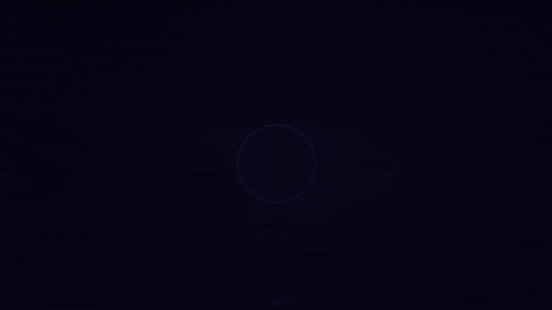
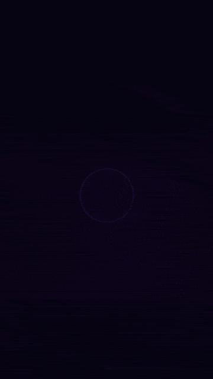
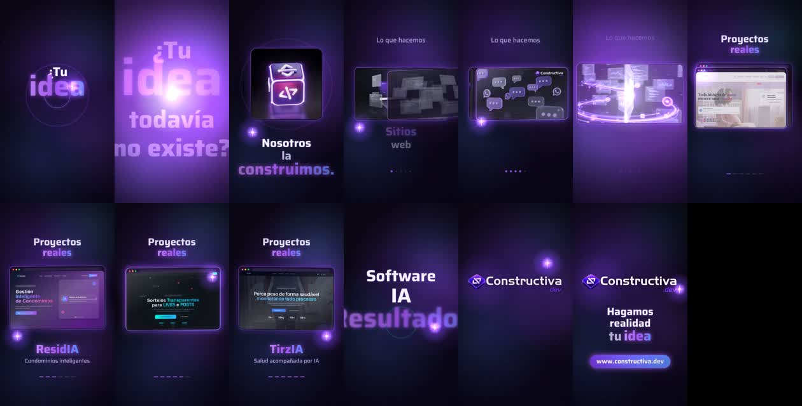
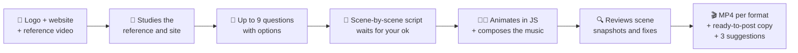

<div align="center">

[🇧🇷 Português](README.md) · **🇺🇸 English**

# 🎬 JSmotion-skill

### Studio-quality brand videos, made by Claude, in **one conversation**.

**No After Effects. No Premiere. No generic templates. No editor.**<br>
Send your logo and website — Claude studies them, asks a few questions, writes the script, animates it in **Remotion (React)**, adds the soundtrack and hands you a **ready-to-post MP4**.<br>
Works with **Claude**, **Codex**, **Gemini CLI**, **Hermes Agent**, **OpenClaw**, **Cursor** and **GitHub Copilot**.

[](#-install-in-1-minute)
[-0B84F3?style=for-the-badge&logo=react&logoColor=white)](references/remotion.md)
[](references/remotion.md)
[](scripts/render.py)
[](LICENSE)
[](#-any-agent)

[](https://github.com/flavioduque/Jsmotion-skill/stargazers)
[](https://github.com/flavioduque/Jsmotion-skill/network/members)

<br>

&nbsp;

<sub>🤯 <b>These GIFs were made with jsmotion</b> — same code, <b>16:9 and 9:16</b>. ▶️ With sound: <a href="docs/demo-en.mp4">MP4 16:9</a> · <a href="docs/demo-vertical-en.mp4">MP4 9:16</a></sub>

<br><br>

**[⚡ Install](#-install-in-1-minute)** · **[🤖 Other agents](#-any-agent)** · **[🎞️ References](#️-supported-references)** · **[🎥 How it works](#-how-it-works)** · **[✨ Features](#-what-makes-it-look-studio-made)** · **[🧠 Under the hood](#-under-the-hood)** · **[❓ FAQ](#-faq)**

</div>

---

## 💥 In one sentence

> **You say:** *"Make me a jsmotion video for my brand, website www.mycompany.com"* — and attach your logo.
>
> **Claude delivers:** a **pack of 1080p MP4s with music and sound effects — 9:16, 1:1 and 16:9 of the same video** —, **ready-to-post copy** (if you want it — with or without emojis), and **3 suggestions** to make the next one even better.

One conversation. Zero timeline. Zero manual keyframes.



<sub>👆 Real frames from a 25s 9:16 video the skill made for <a href="https://www.constructiva.dev">Constructiva.dev</a> (Spanish copy) — from hook to call to action.</sub>

---

## 🤯 Why this changes the game

| | 🧑‍🎨 Agency / freelancer | 🧩 Online template | 🎬 **jsmotion** |
|---|:---:|:---:|:---:|
| Time to first video | days or weeks | hours | **one conversation** |
| Studies your site and pulls colors/projects | ✅ | ❌ | ✅ **automatic** |
| Copies the style of a reference video | ✅ | ❌ | ✅ **automatic** |
| Soundtrack synced to every word | sometimes | ❌ | ✅ **generated in code** |
| Same animation in 9:16, 1:1, 4:5 and 16:9 | 💸 extra fee | partial | ✅ **one request, every format** |
| You own the video's "source code" | ❌ | ❌ | ✅ **open, editable JS** |
| Platform-standard loudness (−14 LUFS) | ✅ | ❌ | ✅ **mastered at render** |
| Cost of a new version | 💸💸💸 | subscription | **one message** |

---

## ⚡ Install in 1 minute

### Option A — claude.ai (recommended, no terminal)

1. Download [`dist/jsmotion.skill`](dist/jsmotion.skill) *(or the file from the latest [release](https://github.com/flavioduque/Jsmotion-skill/releases))*.
2. On claude.ai: **Settings → Capabilities → Skills → `+`** and upload the file.
3. Turn on **"Code execution and file creation"**.

Done. ✅

### Option B — Claude Code

```bash
git clone https://github.com/flavioduque/Jsmotion-skill.git ~/.claude/skills/jsmotion
```

> [!NOTE]
> The skill was designed for the claude.ai environment (`/home/claude` and `/mnt/user-data/outputs` folders). It also works in Claude Code — Claude uses your working folder instead. You need **Python 3**, **Node 18+ with npm** (Remotion is installed on first run), **ffmpeg** and a **Chromium** (Playwright's works; with none, Remotion downloads its own). Already have Chromium? Point to it with `CHROMIUM_PATH=/path/to/chrome`. Files go to `./jsmotion-work` (work) and `./jsmotion-out` (deliverables) — or wherever you point `JSMOTION_WORKDIR` and `JSMOTION_OUTDIR`.

> [!TIP]
> The skill's instructions are written in Portuguese, but **Claude talks to you in your language** and writes the on-screen copy in whatever language you ask for.

### Option C — Codex, Gemini CLI, Hermes Agent, OpenClaw, Cursor, Copilot…

```bash
git clone https://github.com/flavioduque/Jsmotion-skill.git && cd Jsmotion-skill
./install.sh codex      # or: gemini · hermes · openclaw · cursor · copilot · universal · claude
```
Each agent gets its own variant and folder. Details are in [🤖 Any agent](#-any-agent).

---

## 🤖 Any agent

jsmotion follows the open **[Agent Skills](https://agentskills.io)** standard (`SKILL.md`), adopted by Claude,
Codex, Gemini CLI, Hermes Agent, OpenClaw, Cursor and GitHub Copilot. The workflow and the scripts are **the same everywhere**.
What changes is **how the agent asks questions, looks at images and delivers files**, and each variant is already
tuned for that ([`agents/`](agents)).

| Agent | Variant | Install (clone + 1 command) | Folder | How to call it |
|---|---|---|---|---|
| **Claude** (claude.ai) | root | upload [`dist/jsmotion.skill`](dist/jsmotion.skill) | — | ask for an animated video |
| **Claude Code** | root | `./install.sh claude` | `~/.claude/skills/jsmotion` | ask, or `/jsmotion` |
| **OpenAI Codex** | [`codex`](agents/codex/jsmotion) | `./install.sh codex` | `~/.agents/skills/jsmotion` | `$jsmotion` or ask |
| **Gemini CLI** | [`gemini`](agents/gemini/jsmotion) | `./install.sh gemini` | `~/.gemini/skills/jsmotion` | ask (Gemini activates it) |
| **Hermes Agent** | [`hermes`](agents/hermes/jsmotion) | `./install.sh hermes` | `~/.hermes/skills/creative/jsmotion` | `/jsmotion` or ask |
| **OpenClaw** | [`openclaw`](agents/openclaw/jsmotion) | `./install.sh openclaw` | `~/.openclaw/skills/jsmotion` | `/jsmotion` or ask in chat |
| **Cursor** | [`universal`](agents/universal/jsmotion) | `./install.sh cursor` | `~/.cursor/skills/jsmotion` | ask in Agent mode |
| **GitHub Copilot** | [`universal`](agents/universal/jsmotion) | `./install.sh copilot` | `~/.copilot/skills/jsmotion` | ask in agent mode |
| **Others** (OpenCode…) | [`universal`](agents/universal/jsmotion) | `./install.sh universal` | `~/.agents/skills/jsmotion` | ask |

`--project` installs into the current project only (e.g. `./install.sh copilot --project` → `.github/skills/jsmotion`).
Without cloning: `curl -fsSL https://raw.githubusercontent.com/flavioduque/Jsmotion-skill/main/install.sh | bash -s -- codex`.

**Requirements everywhere:** Linux or macOS (on Windows, use WSL), **Python 3**, **git** and **internet** on the
first run. `install_watch.sh` installs ffmpeg, Playwright and yt-dlp if they're missing. If Chromium is already
installed, set `CHROMIUM_PATH=/path/to/chrome`. Files go to `./jsmotion-work` and `./jsmotion-out` in the agent's
working folder (or `JSMOTION_WORKDIR` / `JSMOTION_OUTDIR`).

<details>
<summary><b>🟠 Claude — claude.ai and Claude Code</b></summary>

<br>

- **Use case:** the main version. On **claude.ai** it's the smoothest experience: tappable question buttons, file
  previews and direct downloads. In **Claude Code** it runs on your machine, with files in your project folder.
- **Install:** claude.ai → upload `dist/jsmotion.skill` ([step by step](#option-a--claudeai-recommended-no-terminal)).
  Claude Code → `./install.sh claude` (or `git clone … ~/.claude/skills/jsmotion`).
- **Use:** *"Make me a jsmotion video for my brand, website www.example.com"* and attach your logo.
- **Implementation:** questions via `ask_user_input_v0`/`AskUserQuestion`, visual review via `view`/`Read`, delivery via `present_files`.
</details>

<details>
<summary><b>⚫ OpenAI Codex — CLI, IDE and app</b></summary>

<br>

- **Use case:** for people who already use Codex in the terminal or the editor. The video lands in the project folder, ready to commit.
- **Install:** `./install.sh codex` → `~/.agents/skills/jsmotion` (project: `--project` → `.agents/skills`).
  Natively, inside Codex:
  ```text
  $skill-installer install https://github.com/flavioduque/Jsmotion-skill/tree/main/agents/codex/jsmotion
  ```
  Restart Codex after installing.
- **Use:** `$jsmotion make a video for my brand, website www.example.com`, or just ask. The skill shows up in `/skills`.
- **Implementation:** Codex has no option buttons, so the skill asks **one numbered question at a time and waits**.
  It reviews images with `view_image` and finishes by listing the files. Ships `agents/openai.yaml` with a display name and description for the app.
- **Watch out:** **the default sandbox blocks internet access**, and the first run needs it to install dependencies,
  download the reference and read the website. Approve when Codex asks, or enable sandbox network access in the
  settings. Rendering takes minutes, so the skill runs `render.py` in the background and follows the log.
</details>

<details>
<summary><b>🔵 Gemini CLI</b></summary>

<br>

- **Use case:** for people using Gemini in the terminal, with Gemini 3.x models (which can see the review sheets).
- **Install:** `./install.sh gemini` → `~/.gemini/skills/jsmotion` (project: `--project` → `.gemini/skills`).
  Natively:
  ```bash
  gemini skills install https://github.com/flavioduque/Jsmotion-skill.git --path agents/gemini/jsmotion
  ```
  In an open session: `/skills reload`. To check: `gemini skills list`.
- **Use:** ask for the video. Gemini activates the skill (`activate_skill`) and **asks for your confirmation**.
- **Implementation:** questions via `ask_user` (`choice` type, short header), images via `read_file`, commands via
  `run_shell_command`, with the render in the background.
- **Watch out:** Gemini asks for confirmation on each new command. The skill explains beforehand that it will
  install ffmpeg and Playwright and download the reference.
</details>

<details>
<summary><b>🟣 Hermes Agent (Nous Research)</b></summary>

<br>

- **Use case:** Hermes runs on a server and talks to you over **Telegram, Discord, WhatsApp or Slack**. Ask for the
  video from your phone and get the MP4 right in the chat.
- **Install:** `./install.sh hermes` → `~/.hermes/skills/creative/jsmotion`. Natively:
  ```bash
  hermes skills install flavioduque/Jsmotion-skill/agents/hermes/jsmotion --category creative
  ```
  The variant passes Hermes' security scanner (`SAFE` verdict). Then: `/reset` or start a new session.
- **Use:** `/jsmotion`, or just say *"make an animated video of my brand"* and send your logo in the chat.
- **Implementation:** uses Hermes' frontmatter (version, author, `platforms`, `category: creative`) and
  `${HERMES_SKILL_DIR}` to locate its scripts. Asks with `clarify`, reviews with `vision_analyze`, and delivers by
  writing each file path on its own line, which the gateway sends as media (`[[as_document]]` sends the MP4 without recompression).
- **Watch out:** the server needs Python 3, Node/npm, git and internet; ffmpeg and Remotion are installed on the first run.
  On a phone, the skill asks one question per message.
</details>

<details>
<summary><b>🦞 OpenClaw</b></summary>

<br>

- **Use case:** OpenClaw is a personal assistant that runs on your machine or server and talks to you over
  **WhatsApp, Telegram, Discord, Slack or iMessage**. Send your logo in the chat, answer the questions from your
  phone and get the MP4 right in the conversation.
- **Install:** `./install.sh openclaw` → `~/.openclaw/skills/jsmotion` (project/workspace: `--project` → `skills/`).
  Natively, from the clone:
  ```bash
  openclaw skills install ./agents/openclaw/jsmotion --global
  ```
  Then: `/new` in the chat (or `openclaw gateway restart`). To check: `openclaw skills info jsmotion`
  (should show `🎬 jsmotion ✓ Ready`).
- **Use:** `/jsmotion`, or just say *"make an animated video of my brand"* and send your logo.
- **Implementation:** declares in `metadata.openclaw` the 🎬 emoji, the project homepage, the supported systems
  (Linux and macOS) and the required binaries (`python3`, `git`); without them OpenClaw hides the skill instead of
  failing halfway. Asks one numbered question per message, reviews with the `image` tool, runs the scripts with
  `exec`, and delivers with the `message` tool (`media`/`filePath`) or a `MEDIA:/path` line. If the channel rejects
  the MP4 for size, it renders a lighter version with ffmpeg and sends that.
- **Watch out:** OpenClaw **doesn't substitute variables** in the skill text; it shows the path to `SKILL.md`, and
  the variant tells the agent to use that real path. If `~/.agents/skills/jsmotion` also exists (e.g. the Codex
  variant), OpenClaw gives it priority. It works, but with the Codex instructions.
</details>

<details>
<summary><b>⚪ Cursor, GitHub Copilot, OpenCode and others</b></summary>

<br>

- **Use case:** make the video without leaving the editor, right in the project folder (e.g. your app's launch video).
- **Install:**
  - Cursor: `./install.sh cursor` → `~/.cursor/skills/jsmotion` (project: `.cursor/skills`).
  - Copilot (VS Code, Copilot CLI, cloud agent): `./install.sh copilot` → `~/.copilot/skills/jsmotion`
    (project: `--project` → `.github/skills`).
  - Any agent that reads `~/.agents/skills`: `./install.sh universal`.
- **Use:** in agent mode, ask for the video. The skill is activated by its description.
- **Implementation:** neutral instructions, plus the tool table for every agent. Uses the agent's question tool if
  there is one; otherwise asks a numbered question and waits. Visual review needs a vision-capable model; without
  one, the skill asks you to open `review.jpg`.
- **Watch out:** the agent's terminal needs internet on the first run. If it has a time limit, the skill runs the
  render in the background and follows the log.
</details>

**Actually verified:** skill discovery was tested on the real **Codex CLI 0.157**, **Gemini CLI 0.61**,
**Hermes Agent** and **OpenClaw 2026.6**. The frontmatter passes the standard's official validator (`agentskills validate`), and all four
variants pass as `SAFE` in Hermes' security scanner. Details in [`agents/`](agents).

---

## 🚀 Usage

Attach **your logo** (and, optionally, a **reference video** you love) and write:

```text
Make me a jsmotion video for my brand X, website www.example.com
```

It also works without saying "jsmotion": *"make an animated video of my company for Reels"*, *"I want a motion video with my logo"*, *"make something like this video"*…

---

## 🎞️ Supported references

Send a reference video and the skill copies its **style** (palette, typography, pacing, transitions). It can be a
file or a link.

**No reference?** The skill picks one by itself on [prompt-motion.com](https://www.prompt-motion.com), a gallery of
motion videos made with Claude, with the prompt behind each one. It looks at the posters in your video's format, watches
frames of the best candidates, chooses the reference that fits your brand and shows you 2 alternatives as art-direction
options. The videos belong to their creators and are used only as a style reference.

| Source | Supported? | Notes |
|---|:---:|---|
| **File** MP4, MOV, WEBM, MKV | ✅ | the most reliable option: works in any environment |
| **YouTube** (videos and Shorts) | ✅ | YouTube often blocks downloads from cloud servers (403 error); then send the file |
| **Instagram** (Reels, posts) | ✅ | public posts; private or login-only content fails |
| **TikTok** | ✅ | public videos |
| **Pinterest — video pin** | ✅ | link to **one pin** (`pinterest.com/pin/…` or `pin.it/…`) |
| **Pinterest — image pin** | ❌ | the analysis needs motion; the skill tells you the pin is an image |
| **Pinterest — board/profile** | ❌ | send the link to one specific video pin |
| **Dribbble** | ❌ | **not supported**: the site blocks automated downloads (anti-bot) and its API only shows the owner's own shots. Save the video (right-click the shot's video → *Save video as…*) or record your screen, and send the **file** |
| **Vimeo, X/Twitter, Facebook, LinkedIn** | ✅ | public videos |
| **Direct link** to an `.mp4` | ✅ | any site |

- **Multiple references:** send several at once, or switch mid-conversation. Each one is analyzed **from scratch,
  in its own folder**, and Claude shows the source, format and duration so you can check it's the right video.
- **Rejected links:** Dribbble and Pinterest board links are rejected right away, with an explanation. Links that
  fail to download (private, login, blocked) make Claude ask for the file, **never** use another reference instead.

---

## 🎙️ New: narrated video (kinetic typography)

For videos that **explain, take a stance or show behind the scenes**, the voice drives everything — like the most-watched motion Reels:

- **The voice becomes the timeline.** You approve the narration text; the voice comes from ElevenLabs (with the exact
  timing of every character), from **your own recording** (aligned word by word with faster-whisper) or from nowhere
  (kinetic text on the beat). Each scene starts at its `[marker]` in the text.
- **Kinetic typography.** Each word appears the moment it is spoken (`blurIn`, `rise`, `pop`, `decode`, `type`,
  `stretch`), the `*keyword*` lights up in the accent color, and the climax becomes one **giant** word with a riser and a hit.
- **Studio finish.** Fixed HUD (scene code, `REC 00:00:12:04`, corners, grid), light bloom, chromatic aberration on
  hits, light sweeps, a camera that never stops, motion blur on the final render and music that **ducks by itself**
  while someone speaks.
- **Preview before rendering.** A fast preview (half resolution, 15 fps) to approve pacing and sync.
- **Real soundtrack.** ElevenLabs Music (at the exact video length), your own track or one from a free library —
  `music.py` finds BPM and beats, and scene changes land on the beat. The in-code soundtrack stays as a free option
  (lower quality), and sound effects are still synthesized.

Guide (Portuguese): [`references/narrado.md`](references/narrado.md).

## 🎥 How it works


```mermaid
flowchart LR
    A["📎 Logo + website<br/>+ reference video"] --> B["👀 Studies the<br/>reference and site"]
    B --> C["💬 Up to 9 questions<br/>with options"]
    C --> D["📝 Scene-by-scene script<br/>waits for your ok"]
    D --> E["🧑‍💻 Animates in JS<br/>+ composes the music"]
    E --> F["🔍 Reviews scene<br/>snapshots and fixes"]
    F --> G["🎬 MP4 per format<br/>+ ready-to-post copy<br/>+ 3 suggestions"]
```

<details open>
<summary><b>1 · Research before asking</b></summary>

- **Reference video (file or link):** uses the [watch](https://github.com/taoufik123-collab/claude-watch) skill to extract frames into a contact sheet. Accepts a file or a link (YouTube, Instagram, TikTok, Pinterest video pin… — **not Dribbble**; see [Supported references](#️-supported-references)). Each reference is analyzed **from scratch, in its own folder**, and Claude checks that the analyzed video is the one you sent. Its observations (palette, typography, pacing, transitions) feed the art direction, and during review the result is compared side by side with the reference.
- **Brand website:** downloads HTML + JS/CSS, ranks the **most-used colors**, detects the **brand fonts**, gathers the **marketing copy** (headlines, sentences, buttons, **prices** and **proof numbers**, into a `textos.md`) and **downloads images and videos** — even from SPA sites (React/Vite), where copy and media live inside the bundle (split by language, marketing first). The script uses the brand's real phrases and numbers.
- **Logo:** uses the **original** file. Never redraws it — only trims transparent margins and resizes. Logo as a JPG or on a white background? The flat background is removed automatically (white inside the logo stays).
- **No website?** Claude asks for the link first (site, Instagram, Linktree…). If there is none, it pulls the **palette from the logo itself** and any materials you send (`brand_palette.py`): brand colors vs. neutrals, background/text/accent roles with checked contrast and a swatch for you to approve — always with the hex and where each color came from.
- **Art direction:** combines brand, topic, audience and reference into an `estilo.md` with concept, palette, fonts, motion, sound and topic metaphors. No predefined style.
</details>

<details open>
<summary><b>2 · Few questions, all multiple-choice</b></summary>

At most **9 questions, one at a time** (the first one: narrated or flyer-style video), each with 3 options + *"I don't know, you choose"* + Claude's recommendation:

| # | Question | Example options |
|---|---|---|
| 1 | **Is it for social media? Where you'll post** | **pack 9:16 + 1:1 + 16:9** · 9:16 only · another combination (4:5, 1:1, 16:9) |
| 2 | **Length** | 15s · 25s · 40s — or **any value from 6 to 90s** |
| 3 | **Art direction** | 3 directions created from the analysis (e.g. "Trust dossier — navy, gold and cream, stamps and contracts") |
| 4 | **Hook (first 3 seconds)** | provocative question · bold statement · promise of results |
| 5 | **Guiding element** (only if the direction calls for it) | spark · self-drawing line · stamp · cursor… |
| 6 | **Sound** | premium · energetic · calm · epic · minimal — matching the tone |
| 7 | **Call to action** | 3 CTAs — recommends the one that "closes" the hook |
| 8 | **Post copy** (if it's for social media) | **yes, with emojis** · yes, no emojis · no thanks |

If the answer is already in the conversation, the question is skipped.

**📝 Ready-to-post copy:** if the video is for social media and you want the caption, Claude delivers it with the
MP4, one version per network (Instagram, TikTok, LinkedIn, YouTube…) following
[`references/copy.md`](references/copy.md): a **scroll-stopping first line**, short copy with **real** benefits and
numbers from your site, **the same call to action as the video**, the right hashtags, emojis **only if you want
them**, plus 2 alternative hooks and the Reels cover text.
</details>

<details open>
<summary><b>3 · Script before code</b></summary>

Scene by scene, with timings, exact copy, what moves and the sound. The structure follows a retention curve:

```text
hook ~12% │ twist ~12% │ services ~20% │ proof/projects ~34% │ promise ~12% │ logo + CTA 2.5s
```
</details>

<details open>
<summary><b>4 · Produce, review, deliver</b></summary>

- Builds the video as a **Remotion (React)** project with the real media, the voice and the soundtrack.
- Takes **15–18 snapshots** (including mid-transitions) and hunts for leaking text, overlaps, text too close to the edge, altered logos, empty scenes — fixes and reviews again.
- Renders **frame by frame** in headless Chromium → **MP4 H.264 (CRF 17) + AAC 192k**, **all formats in parallel**.
- **Masters the audio to −14 LUFS** (the loudness Instagram, TikTok and YouTube use), true peak below −1.5 dBTP, and delivers.
</details>

---

## 🎨 No preset style: art direction comes from analysis

jsmotion **has no default look** — no neon, no gold, no "house template". Before writing any code, Claude writes an
**art direction** for that specific video ([`references/direcao-de-arte.md`](references/direcao-de-arte.md)), based on:

| Source | What it extracts |
|---|---|
| 🏷️ **The brand** | site palette, **fonts** and photos (`scrape_site.py`); no site → palette extracted from the logo and materials (`brand_palette.py`); tone of voice |
| 🎯 **The topic and audience** | what is sold, to whom, in which country, the customer's fears and desires |
| 🎞️ **The reference** (if any — **takes priority**) | pacing, transitions, typography, composition and photo treatment of the video you sent |
| 📱 **The destination** | Reels/TikTok (strong hook, fast pace) · LinkedIn (sober) · YouTube/site (more breathing room) |

From that come a **role-based palette, a type pairing (any Google Font), highlight, composition, motion, transitions,
texture, photo grading and sound** — plus **topic metaphors**: scenes that only make sense for that subject (a real
estate course gets *EMBARGO* stamps and contract sheets; a clinic, the before/after; a restaurant, the handwritten
order ticket). **With no reference, the direction comes from the brand and topic alone** — which is where getting it right matters most.

> 🎞️ **Sent a reference? It takes priority.** Pacing, composition, typography, text reveals, transitions and photo
> treatment follow the video you sent; your brand comes in with its logo, colors, content and topic metaphors,
> inside that visual language. Want it identical, colors included? Just say so. During review, the result is compared
> side by side with the reference before delivery.

At the style question, Claude offers **3 directions generated by the analysis** (the 1st recommended), not 3 presets —
with a reference, the 1st is always **faithful to it, with your brand**.
Final test: *if you could swap the logo for another brand's and the video still works, it's generic* — and Claude goes back to fix it.

**How it becomes a video:** every video is a [**Remotion**](https://www.remotion.dev) (React) project. The
[`templates/remotion`](templates/remotion) kit has **no style of its own** — real media with framing, cards, words
timed to the voice, badges, counters, scenes that converge/orbit/open full screen, music that ducks under the voice —
and the look comes entirely from the `src/style.ts` Claude writes from the art direction (or your brand's approved
design system).

### ✨ Quality bar (applies to any style)

- 🎯 **A hook in the first second** — number + benefit or a strong question; never open with just the logo.
- 📸 **Real client media** (photos, renders, screens) whenever it exists.
- ✂️ **One idea per scene**, 2–3.5 s each.
- 📱 **Phone-legible** — big headlines, lists of up to 5 items, short lines.
- 🔠 **Type hierarchy** from the art direction; highlight only the key word.
- 🏷️ **A fixed brand frame** (logos + signature) and **animated numbers** for proof.
- 🧩 **Topic metaphors** in at least 1–2 scenes.
- 🔊 **Sound that fits the tone**, mastered to −14 LUFS with no clipping.
- 🏁 **An actionable ending** with the original logo + contact button.

---

## 📐 Formats

| Format | Resolution | Where to use | Layout |
|---|---|---|---|
| 📱 Vertical 9:16 | 1080×1920 | Reels · TikTok · Shorts · Stories | the original design |
| 🖼️ Portrait 4:5 | 1080×1350 | Instagram/Facebook feed | stacked, scaled into the safe area |
| ⬛ Square 1:1 | 1080×1080 | Feed · LinkedIn | stacked, scaled into the safe area |
| 🖥️ Landscape 16:9 | 1920×1080 | YouTube · website · presentations | media on the left, text on the right |

**One codebase, every format:** scenes are drawn once and a "stage" fits each block (media, text, full screen) into the chosen format. The 9:16 output is pixel-identical to the design. Always **30 fps**. The 9:16 safe area avoids the apps' UI (top and bottom) — your text never hides behind the like button.

---

## 🧠 Under the hood

<details>
<summary><b>Why Remotion (React) instead of a video editor?</b></summary>

<br>

Every frame is a **pure function of time** written in React — Remotion renders it frame by frame in Chromium and
outputs the MP4. Deterministic (identical on every render), **exactly in sync with the voice** (each narrated word has
its timestamp), editable as code, and the 4 formats come from the same code. Remotion only: no HyperFrames, After
Effects or other engines.
</details>

---

## 🗂️ Structure

```text
jsmotion/
├── SKILL.md                 🧠 the step-by-step Claude follows
├── scripts/                 watch_reference.sh · find_reference.py · scrape_site.py · brand_palette.py · get_font.py
│                            voice.py (narration → per-word timeline) · music.py (real soundtrack)
│                            assets.py (Remotion project: media, logo, voice, music, fonts) · render.py (stills, preview, MP4)
├── templates/remotion/      ⚛️ the project template: style.ts (art direction), kit.tsx (pieces), Video.tsx, Root.tsx
├── references/              remotion.md · direcao-de-arte.md · narrado.md · formats.md · copy.md (Portuguese)
├── agents/                  🤖 variants for Codex, Gemini, Hermes, OpenClaw and others (generated)
└── tools/build_agents.py    🔧 builds the variants from SKILL.md
```

---

## 🛠️ Running the scripts by hand

```bash
SK=/path/to/jsmotion
python3 $SK/scripts/assets.py new  video                          # 1. Remotion project
python3 $SK/scripts/assets.py add  video clip.mp4 photo.jpg       # 2. real media
python3 $SK/scripts/assets.py logo video logo.png                 #    logo (flat background removed)
# 3. edit video/src/style.ts (art direction) and video/src/Video.tsx (the video)
python3 $SK/scripts/render.py video my-brand --stills 0.5 2 4 8           # 4. review sheet
python3 $SK/scripts/render.py video my-brand --formats 9x16,1x1,16x9      # 5. MP4s in jsmotion-out/
```
Live preview while editing: `cd video && npx remotion studio src/index.ts`.

---

## ❓ FAQ

<details>
<summary><b>Do I need to know how to code?</b></summary>

No. The skill was written for beginners: Claude speaks plainly, asks with tappable options and shows the script before producing anything. Coding is its job.
</details>

<details>
<summary><b>How long does rendering take?</b></summary>

It depends on the machine and how much video is on screen: usually **1× to 3× the video length per format** (a 40 s reel in 9:16 takes ~5–15 minutes). The review sheet and the half-resolution preview come much sooner.
</details>

<details>
<summary><b>What if the environment can't render the MP4?</b></summary>

You get the zipped **Remotion project**. On your computer: `npm install` and `npx remotion render src/index.ts v9x16 video.mp4` (or `npx remotion studio src/index.ts` to preview and export).
</details>

<details>
<summary><b>Can the video copy be in another language?</b></summary>

Yes. The conversation happens in your language and the on-screen copy comes out in whatever language you ask for — the bundled example is in Spanish, and the promo at the top exists in [English](docs/demo-en.gif) and [Portuguese](docs/demo.gif).
</details>

<details>
<summary><b>Is the music copyrighted?</b></summary>

The soundtrack comes from a commercially usable source: generated with **ElevenLabs Music** (exact length), your own track, or a free library (Pixabay Music, YouTube Audio Library) — or no music in the file, to use a trending sound in the app.
</details>

<details>
<summary><b>Can I send the reference as a link, or only an MP4?</b></summary>

Both. A file (MP4, MOV, WEBM…) or a **YouTube, Instagram, TikTok, Pinterest (video pin), Vimeo, X, Facebook** or
direct `.mp4` link, downloaded with `yt-dlp`. **Dribbble is not supported** (it blocks automated downloads): save the
video and send the file. The full list is in [Supported references](#️-supported-references). You can send **several references** and switch references mid-conversation: each one is
analyzed from scratch. If a link fails (private video, login required, or the site blocks downloads from Claude's
environment, as YouTube often does on servers), Claude tells you and asks for the file instead of using another reference.
</details>

<details>
<summary><b>Can I use another font?</b></summary>

Yes — there is no default font. Claude picks the type pairing during art direction (preferably your site's fonts) and downloads any Google Fonts family with `scripts/get_font.py "Family Name"`. Commercial fonts (Söhne, Gotham…) are replaced by the closest free alternative; if you own a licensed `.woff2`, it goes into the project's `public/fonts`.
</details>

---

## 🗺️ Roadmap

- [ ] Community video gallery
- [x] Art direction by analysis (brand, topic, audience, reference) — no predefined style
- [x] Remotion (React) engine with a style-less kit (`style.ts`) and any Google Font
- [ ] Automatic burned-in captions
- [x] Narrated video: voice (ElevenLabs or your recording) → word-by-word text, in sync
- [x] Real soundtrack (external track or ElevenLabs Music) with BPM, beats and ducking under the voice
- [ ] Continuous stage: elements that travel across scenes and a camera that "dives" into them
- [ ] UI component library (code editor, timeline, charts, phone, chat)
- [ ] "Filmed screen" mode: the video mapped onto a real monitor filmed by the user
- [x] Multi-format pack (9:16, 4:5, 1:1 and 16:9) from the same code
- [x] Audio mastered to −14 LUFS
- [ ] Automatic layout review (text outside the safe area)
- [ ] English version of `SKILL.md`
- [x] Variants for Codex, Gemini CLI, Hermes Agent, OpenClaw, Cursor and Copilot ([`agents/`](agents))

Got an idea? [Open an issue](https://github.com/flavioduque/Jsmotion-skill/issues) 💡

---

## 🤝 Contributing

PRs are very welcome! The most helpful ones:

1. **New pieces** in `templates/remotion/src/kit.tsx` (scenes, transitions, badges).
2. **Example** `Video.tsx` files for other niches.
3. **Improvements to `scrape_site.py`** for more kinds of sites.
4. **Translations** of the skill's instructions and references.

> **Edited `SKILL.md`, `scripts/`, `templates/` or `references/`?** Run `python3 tools/build_agents.py` to refresh the variants in `agents/` (`--check` verifies they're up to date).

Show off what you made! Post it with **#jsmotion** and tag the repo — the best ones go into the gallery.

---

## 🙏 Credits

- Reference-video reading: [claude-watch](https://github.com/taoufik123-collab/claude-watch)
- Fallback fonts: [Inter](https://fonts.google.com/specimen/Inter) and [Playfair Display](https://fonts.google.com/specimen/Playfair+Display) (SIL Open Font License)
- Engine: [Remotion](https://www.remotion.dev) (own license: free for individuals and small companies; larger companies need a company license — [remotion.dev/license](https://www.remotion.dev/license)) · audio: [FFmpeg](https://ffmpeg.org)

---

<div align="center">

### ⭐ If jsmotion saved you a week of editing, leave a star.

It's what helps the skill reach more people.

[](https://github.com/flavioduque/Jsmotion-skill)

<br>

Made with 💜 by **[Flavio Duque](https://github.com/flavioduque)** · [Constructiva.dev](https://www.constructiva.dev)

<sub><a href="LICENSE">MIT</a> licensed — use it, change it, sell the videos.</sub>

</div>
