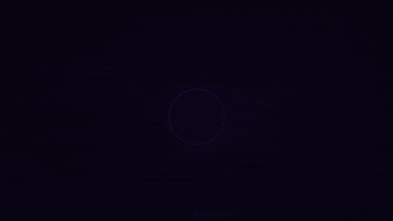
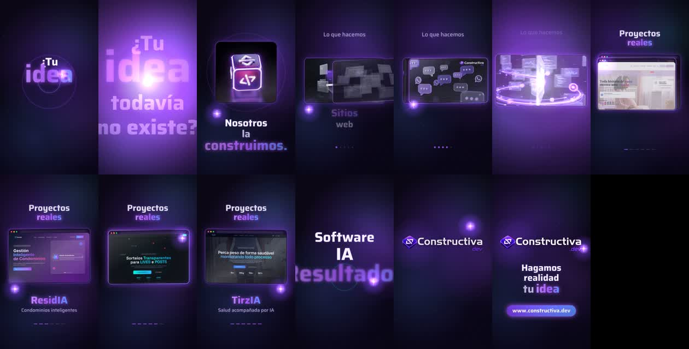
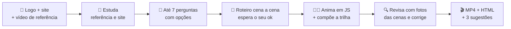

<div align="center">

# 🎬 jsmotion

### Seu vídeo de marca nível estúdio, feito pelo Claude, em **uma conversa**.

**Sem After Effects. Sem Premiere. Sem template genérico. Sem editor.**<br>
Você manda a logo e o site — o Claude estuda, pergunta, escreve o roteiro, anima em JavaScript, compõe a trilha e entrega o **MP4 pronto**.

[](#-instalar-em-1-minuto)
[](references/engine.md)
[](references/engine.md#som-buildaudio)
[](scripts/render.py)
[](LICENSE)

[](https://github.com/flavioduque/Jsmotion-skill/stargazers)
[](https://github.com/flavioduque/Jsmotion-skill/network/members)

<br>



<sub>🤯 <b>Este GIF foi feito pelo próprio jsmotion</b> — mesmo motor, mesmo fluxo. <a href="docs/demo.mp4">▶️ Ver com trilha sonora (MP4)</a> · <a href="examples/promo-16x9">🧑‍💻 Ver o código</a></sub>

<br><br>

**[⚡ Instalar](#-instalar-em-1-minuto)** · **[🎥 Como funciona](#-como-funciona)** · **[✨ Recursos](#-o-que-deixa-o-vídeo-com-cara-de-estúdio)** · **[🧠 Por dentro](#-por-dentro-do-motor)** · **[❓ FAQ](#-faq)**

</div>

---

## 💥 Em uma frase

> **Você diz:** *"Quero um vídeo jsmotion da minha marca, site www.minhaempresa.com"* — e anexa a logo.
>
> **O Claude devolve:** um **MP4 1080p com trilha e efeitos sonoros**, um **.html** de reserva com botão *"Baixar MP4"* e **3 sugestões** para deixar o próximo ainda melhor.

Uma conversa. Zero timeline. Zero keyframe manual.



<sub>👆 Quadros reais de um vídeo de 25s em 9:16 feito pela skill para a <a href="https://www.constructiva.dev">Constructiva.dev</a> — do gancho à chamada final.</sub>

---

## 🤯 Por que isso muda o jogo

| | 🧑‍🎨 Agência / freelancer | 🧩 Template online | 🎬 **jsmotion** |
|---|:---:|:---:|:---:|
| Tempo até o primeiro vídeo | dias ou semanas | horas | **uma conversa** |
| Estuda o seu site e extrai cores/projetos | ✅ | ❌ | ✅ **automático** |
| Copia o estilo de um vídeo de referência | ✅ | ❌ | ✅ **automático** |
| Trilha sincronizada com cada palavra | às vezes | ❌ | ✅ **gerada por código** |
| Mesma animação em 9:16, 1:1, 4:5 e 16:9 | 💸 cobra à parte | parcial | ✅ |
| Você é dono do "código-fonte" do vídeo | ❌ | ❌ | ✅ **JS aberto e editável** |
| Custo por versão nova | 💸💸💸 | assinatura | **uma mensagem** |

---

## ⚡ Instalar em 1 minuto

### Opção A — claude.ai (recomendado, zero terminal)

1. Baixe [`dist/jsmotion.skill`](dist/jsmotion.skill) *(ou o arquivo da última [release](https://github.com/flavioduque/Jsmotion-skill/releases))*.
2. No claude.ai: **Configurações → Capacidades → Skills → `+`** e envie o arquivo.
3. Ative **"Execução de código e criação de arquivos"**.

Pronto. ✅

### Opção B — Claude Code

```bash
git clone https://github.com/flavioduque/Jsmotion-skill.git ~/.claude/skills/jsmotion
```

> [!NOTE]
> A skill foi desenhada para o ambiente do claude.ai (pastas `/home/claude` e `/mnt/user-data/outputs`). No Claude Code ela também funciona — o Claude usa a sua pasta de trabalho no lugar dessas. É preciso ter **Python 3**, **ffmpeg** e **Chromium/Playwright** (o `install_watch.sh` instala o que faltar). Já tem um Chromium? Aponte com `CHROMIUM_PATH=/caminho/chrome`.

---

## 🚀 Usar

Anexe **a sua logo** (e, se quiser, um **vídeo de referência** que você ama) e escreva:

```text
Quero um vídeo jsmotion da minha marca X, site www.exemplo.com
```

Também funciona sem dizer "jsmotion": *"faz um vídeo animado da minha empresa pro Reels"*, *"quero um motion com a minha logo"*, *"faz algo parecido com esse vídeo"*…

---

## 🎥 Como funciona



<details open>
<summary><b>1 · Estuda antes de perguntar</b></summary>

- **Vídeo de referência:** usa a skill [watch](https://github.com/taoufik123-collab/claude-watch) para extrair quadros e montar uma folha de contato. Anota paleta, ritmo, como o texto entra, transições e o elemento que conduz o vídeo.
- **Site da marca:** baixa HTML + JS/CSS, ranqueia as **cores mais usadas**, pega o título e **baixa imagens e vídeos** — inclusive de sites SPA (React/Vite), onde a mídia fica dentro do bundle.
- **Logo:** usa o arquivo **original**. Nunca redesenha — só recorta a margem transparente e redimensiona.
</details>

<details open>
<summary><b>2 · Pergunta pouco, e com opções</b></summary>

No máximo **7 perguntas, uma por vez**, cada uma com 3 opções + *"Não sei, escolha por mim"* + a recomendação do Claude:

| # | Pergunta | Exemplos de opções |
|---|---|---|
| 1 | **Formato** | 9:16 Reels/TikTok/Shorts · 1:1 ou 4:5 feed · 16:9 YouTube/site |
| 2 | **Duração** | 15s · 25s · 40s — ou **qualquer valor de 6 a 90s** |
| 3 | **Estilo** | o da sua referência com as suas cores · + 2 climas |
| 4 | **Gancho (3 primeiros segundos)** | pergunta provocativa · afirmação forte · promessa de resultado |
| 5 | **Elemento condutor** | faísca de luz · anel de luz · linha que se desenha |
| 6 | **Som** | eletrônico suave · épico e grave · minimalista |
| 7 | **Chamada final** | 3 CTAs — recomenda a que "fecha" o gancho |

Se a resposta já está na conversa, a pergunta é pulada.
</details>

<details open>
<summary><b>3 · Roteiro antes do código</b></summary>

Cena por cena, com tempos, textos exatos, o que se mexe e o som. A estrutura segue uma curva de retenção:

```text
gancho ~12% │ virada ~12% │ serviços ~20% │ provas/projetos ~34% │ promessa ~12% │ logo + CTA 2,5s
```
</details>

<details open>
<summary><b>4 · Produz, revisa e entrega</b></summary>

- Anima tudo num único `<canvas>`, compõe a trilha, empacota os assets num **HTML único que funciona offline**.
- Tira **15–18 fotos de instantes** (incluindo meios de transição) e caça texto vazando, sobreposição, texto perto da borda, logo alterada, cena vazia — corrige e revisa de novo.
- Renderiza **quadro a quadro** em Chromium headless → **MP4 H.264 (CRF 17) + AAC 192k**, confere o volume e entrega.
</details>

---

## ✨ O que deixa o vídeo com cara de estúdio

Regras obrigatórias em todo vídeo gerado:

- 🎯 **Gancho nos 3 primeiros segundos** — o que segura o scroll.
- 🥁 **Algo acontece a cada meio segundo** — tudo pulsa em 120 BPM: anéis, faíscas, entradas.
- ✍️ **Texto palavra por palavra**, com desfoque + escala, e a **palavra principal em destaque** (gradiente + brilho).
- ✨ **Elemento condutor** do início ao fim — a faísca "acende" cada tela no momento em que ela entra.
- 🌊 **Zero corte seco** — só clarão de luz, zoom ou onda líquida.
- 🌌 **Fundo com profundidade** — degradê, luzes desfocadas, partículas, textura de ruído e vinheta.
- 🪟 **Telas em vidro** — janelas com barra de navegador, reflexo passando e borda que acende.
- 🔊 **Som que "vê" a imagem** — cada palavra tem um brilho sonoro, cada troca tem whoosh, cada momento-chave tem impacto grave.
- 🏁 **Final fixo de 2,5s** com a logo original + chamada.

---

## 📐 Formatos

| Formato | Resolução | Onde usar | Área segura p/ texto |
|---|---|---|---|
| 📱 Vertical 9:16 | 1080×1920 | Reels · TikTok · Shorts · Stories | x 90–990 · y 300–1650 |
| 🖼️ Retrato 4:5 | 1080×1350 | Feed Instagram/Facebook | x 90–990 · y 110–1240 |
| ⬛ Quadrado 1:1 | 1080×1080 | Feed · LinkedIn | x 90–990 · y 90–990 |
| 🖥️ Horizontal 16:9 | 1920×1080 | YouTube · site · apresentações | x 160–1760 · y 90–990 |

Sempre **30 fps**. A área segura do 9:16 desvia da interface dos apps (topo e base) — seu texto nunca fica escondido atrás do botão de curtir.

---

## 🧠 Por dentro do motor

<details>
<summary><b>Por que canvas + JavaScript, e não um editor de vídeo?</b></summary>

<br>

Cada quadro é uma **função pura do tempo**: `render(ctx, t)`. Isso dá superpoderes:

- **Determinístico** — nada de `Math.random()` solto; tudo usa `rng(seed)`. O vídeo sai **idêntico** em todo render.
- **Renderização exata** — o `render.py` pede cada quadro `t = f / 30` ao Chromium headless e manda direto pro ffmpeg. Sem quadro perdido, sem travada, independente da velocidade da máquina.
- **Editável como código** — mudar uma cor, um texto ou um tempo é trocar uma linha.

Ordem por quadro:

```text
drawBackground → cenas (scene1..6) → drawSpark (condutor) → transitions → drawNoise → fade-in
```
</details>

<details>
<summary><b>Como a trilha fica sincronizada com a imagem?</b></summary>

<br>

Imagem e som leem a **mesma linha do tempo**:

```js
const WORDS  = [...];              // cada palavra que entra → um "brilho" sonoro
const WH     = [2.7, 5.7, 10.75];  // whooshes (tocados 0,35s antes da troca)
const IMPACT = [3.0, 22.6];        // graves nos momentos-chave
```

A trilha inteira (pad Am–F–C–G, kick, hi-hat, palma, baixo, arpejo, riser, acorde final) é **sintetizada** num `OfflineAudioContext` e vira um único buffer. Por isso a prévia no navegador, a gravação pelo botão e o MP4 renderizado **soam exatamente iguais**. Sem nenhum arquivo de música — e sem problema de direitos autorais.

Variações prontas: **épico** (cordas graves, kick longo, impacto a cada 4s) e **minimalista** (só brilhos, whooshes, impactos e um tique por batida).
</details>

<details>
<summary><b>Kit de blocos reutilizáveis</b></summary>

<br>

| Bloco | O que faz |
|---|---|
| `eOut` `eIn` `eIO` `eBack` · `inv(a,b,t)` | easing e tempo relativo |
| `beatPulse(t)` | 1 no início de cada batida, cai rápido — pulsa anéis, brilhos, botão |
| `glow(ctx,x,y,r,cor,a)` | luz desfocada barata (gradiente radial) |
| `word(ctx,texto,x,y,t,t0,{hl,out,…})` | entrada de palavra com desfoque + escala; `hl` = destaque |
| `ring(...)` | anel de luz |
| `glassFrame(ctx,img,…,{bar,sheen,lit})` | janela de vidro com barra, reflexo e borda que acende |
| `seqFrame(chave,t)` | quadro de um clipe de vídeo do site (15 fps) |
| `sparkPos(t)` + `SPARK_KEYS` | caminho suave (Catmull-Rom) do elemento condutor |
| `flash(tc,dur,cor,max)` | clarão de transição a partir do condutor |

Documentação completa em [`references/engine.md`](references/engine.md).
</details>

---

## 🗂️ Estrutura

```text
jsmotion/
├── SKILL.md                 🧭 o fluxo completo: coleta → perguntas → roteiro → produção → revisão → entrega
├── scripts/
│   ├── install_watch.sh     📦 instala a skill watch + yt-dlp, ffmpeg, Playwright, brotli (idempotente)
│   ├── watch_reference.sh   👀 assiste o vídeo de referência e monta a folha de contato
│   ├── scrape_site.py       🌐 cores, título, imagens e vídeos do site (funciona com SPA)
│   ├── prep_assets.py       🧳 logo, imagens, clipes e fonte → data URIs (assets.js)
│   ├── build_html.py        🧱 junta shell + assets + animação num .html único e offline
│   ├── snap.py              📸 fotos de instantes para revisão + erros do console
│   └── render.py            🎬 render quadro a quadro + áudio → MP4
├── templates/
│   ├── example_anim.js      ⭐ exemplo completo e testado (Constructiva.dev · 25s · 9:16)
│   ├── shell.html           ▶️ página com prévia, botão "Baixar MP4" e ganchos de render
│   └── saira.woff2          🔤 fonte padrão (Saira)
├── examples/
│   └── promo-16x9/          🎞️ exemplo 16:9 — o vídeo de apresentação do próprio jsmotion (docs/demo.gif)
├── references/
│   ├── engine.md            🧠 anatomia do motor
│   └── formats.md           📐 tamanhos, áreas seguras e como adaptar o layout
├── dist/jsmotion.skill      📦 pacote pronto para upload no claude.ai
└── docs/                    🖼️ demo.gif · demo.mp4 · preview.jpg
```

---

## 🛠️ Rodando os scripts na mão

Para quem quer o controle total (o Claude faz tudo isso sozinho):

```bash
SK=~/.claude/skills/jsmotion

python3 $SK/scripts/scrape_site.py https://www.exemplo.com ./site          # 1. estuda o site
cp $SK/templates/example_anim.js anim.js                                   # 2. adapte cores, textos e tempos
python3 $SK/scripts/prep_assets.py config.json assets.js                   # 3. empacota logo/imagens/clipes
python3 $SK/scripts/build_html.py anim.js assets.js video.html "Minha Marca" minha-marca
python3 $SK/scripts/snap.py video.html 0.5 1.5 3 6 11 19 23                 # 4. revisa (→ /tmp/review.jpg)
python3 $SK/scripts/render.py video.html video.mp4                         # 5. MP4 final
```

<details>
<summary>Exemplo de <code>config.json</code></summary>

```json
{
  "logo": "logo.png",
  "logo_width": 1400,
  "images": { "projeto1": "print1.png", "projeto2": "print2.png" },
  "image_size": [1000, 625],
  "clips": { "demo": { "src": "demo.mp4", "start": 2.0, "dur": 1.8, "scale": "560:315" } },
  "font": "minha-fonte.woff2"
}
```

Dica: clipes de 1,5–3,5s a 15 fps e o total abaixo de ~8 MB deixam o HTML leve.
</details>

---

## ❓ FAQ

<details>
<summary><b>Preciso saber programar?</b></summary>

Não. A skill foi escrita para iniciantes: o Claude fala simples, pergunta com opções tocáveis e mostra o roteiro antes de produzir. Programar é trabalho dele.
</details>

<details>
<summary><b>Quanto tempo leva o render?</b></summary>

Cerca de **5 minutos para 25s em 1080×1920** no ambiente do claude.ai. Vídeos menores ou em 1:1 saem mais rápido.
</details>

<details>
<summary><b>E se o ambiente não conseguir renderizar o MP4?</b></summary>

Você recebe o **.html**. Baixe o arquivo → abra no **Google Chrome do computador** → clique em **"Baixar MP4"** → espere a duração do vídeo **sem trocar de aba**. (Em Chromes antigos o arquivo sai em `.webm`.)
</details>

<details>
<summary><b>Os textos do vídeo podem ser em outro idioma?</b></summary>

Sim. A conversa acontece no seu idioma e os textos do vídeo saem no idioma que você pedir — o exemplo incluído é em espanhol.
</details>

<details>
<summary><b>A música tem direitos autorais?</b></summary>

Não existe arquivo de música: a trilha é **sintetizada por código** (Web Audio API) a cada vídeo.
</details>

<details>
<summary><b>Posso usar outra fonte?</b></summary>

Sim. Saira é o padrão (combina com logos geométricas/tech). Para outro clima, baixe do [Google Fonts](https://github.com/google/fonts), reduza com `pyftsubset --flavor=woff2` e aponte no `config.json`.
</details>

---

## 🗺️ Próximos passos

- [ ] Galeria de vídeos gerados pela comunidade
- [ ] Presets de estilo prontos (neon, corporativo, minimalista, retrô)
- [ ] Legendas automáticas queimadas no vídeo
- [ ] Narração por voz sintetizada
- [x] Exemplo nativo em 16:9 ([`examples/promo-16x9`](examples/promo-16x9))
- [ ] Exemplos nativos em 1:1 e 4:5

Tem uma ideia? [Abra uma issue](https://github.com/flavioduque/Jsmotion-skill/issues) 💡

---

## 🤝 Contribuindo

PRs são muito bem-vindos! Os que mais ajudam:

1. **Novos exemplos** em `templates/` (outros formatos, estilos e nichos).
2. **Novos sons** no `buildAudio` (lo-fi, trap, corporativo…).
3. **Melhorias no `scrape_site.py`** para mais tipos de site.

Mostre o vídeo que você fez! Poste com **#jsmotion** e marque o repositório — os melhores entram na galeria.

---

## 🙏 Créditos

- Leitura de vídeo de referência: [claude-watch](https://github.com/taoufik123-collab/claude-watch)
- Fonte padrão: [Saira](https://fonts.google.com/specimen/Saira) (SIL Open Font License)
- Render: [Playwright](https://playwright.dev) + [FFmpeg](https://ffmpeg.org)

---

<div align="center">

### ⭐ Se o jsmotion te poupou uma semana de edição, deixa uma estrela.

É o que faz a skill chegar em mais gente.

[](https://github.com/flavioduque/Jsmotion-skill)

<br>

Feito com 💜 por **[Flavio Duque](https://github.com/flavioduque)** · [Constructiva.dev](https://www.constructiva.dev)

<sub>Licença <a href="LICENSE">MIT</a> — use, modifique e venda vídeos à vontade.</sub>

</div>
