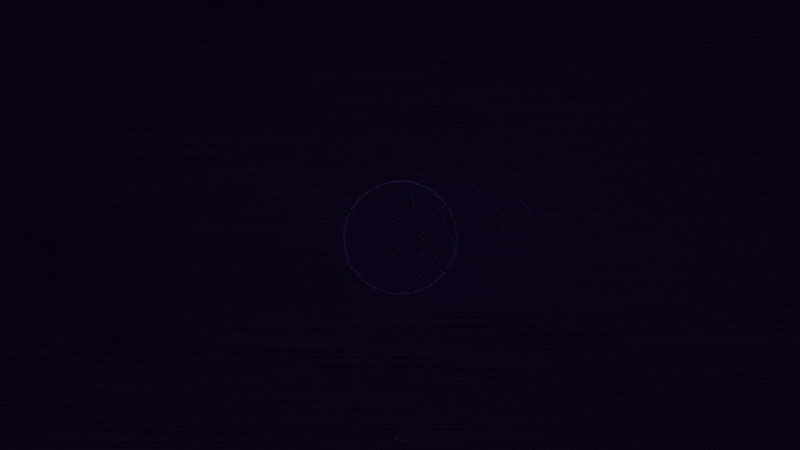
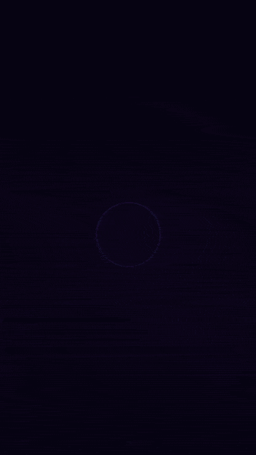
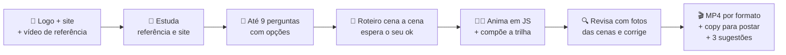

<div align="center">

**🇧🇷 Português** · [🇺🇸 English](README.en.md)

# 🎬 JSmotion-skill

### Seu vídeo de marca nível estúdio, feito pelo Claude, em **uma conversa**.

**Sem After Effects. Sem Premiere. Sem template genérico. Sem editor.**<br>
Você manda a logo e o site — o Claude estuda, pergunta, escreve o roteiro, anima em **Remotion (React)**, monta a trilha e entrega o **MP4 pronto**.<br>
Funciona no **Claude**, **Codex**, **Gemini CLI**, **Hermes Agent**, **OpenClaw**, **Cursor** e **GitHub Copilot**.

[](#-instalar-em-1-minuto)
[-0B84F3?style=for-the-badge&logo=react&logoColor=white)](references/remotion.md)
[](references/remotion.md)
[](scripts/render.py)
[](LICENSE)
[](#-em-qualquer-agente)

[](https://github.com/flavioduque/Jsmotion-skill/stargazers)
[](https://github.com/flavioduque/Jsmotion-skill/network/members)

<br>

&nbsp;

<sub>🤯 <b>Estes GIFs foram feitos com o jsmotion</b> — mesmo código, <b>16:9 e 9:16</b>. ▶️ Com trilha: <a href="docs/demo.mp4">MP4 16:9</a> · <a href="docs/demo-vertical.mp4">MP4 9:16</a><br>
🇺🇸 <b>English:</b> <a href="README.en.md">README</a> · <a href="docs/demo-en.gif">GIF 16:9</a> · <a href="docs/demo-vertical-en.gif">GIF 9:16</a></sub>

<br><br>

**[⚡ Instalar](#-instalar-em-1-minuto)** · **[🤖 Outros agentes](#-em-qualquer-agente)** · **[🎞️ Referências](#️-referências-aceitas)** · **[🎥 Como funciona](#-como-funciona)** · **[✨ Recursos](#-o-que-deixa-o-vídeo-com-cara-de-estúdio)** · **[🧠 Por dentro](#-por-dentro-do-motor)** · **[❓ FAQ](#-faq)**

</div>

---

## 💥 Em uma frase

> **Você diz:** *"Quero um vídeo jsmotion da minha marca, site www.minhaempresa.com"* — e anexa a logo.
>
> **O Claude devolve:** um **pacote de MP4 1080p com trilha e efeitos sonoros — 9:16, 1:1 e 16:9 do mesmo vídeo** —, a **copy pronta para postar** (se você quiser — com ou sem emojis) e **3 sugestões** para deixar o próximo ainda melhor.

Uma conversa. Zero timeline. Zero keyframe manual.


<sub>👆 Quadros reais de um vídeo de 25s em 9:16 feito pela skill para a <a href="https://www.constructiva.dev">Constructiva.dev</a> — do gancho à chamada final.</sub>

---

## 🤯 Por que isso muda o jogo

| | 🧑‍🎨 Agência / freelancer | 🧩 Template online | 🎬 **jsmotion** |
|---|:---:|:---:|:---:|
| Tempo até o primeiro vídeo | dias ou semanas | horas | **uma conversa** |
| Estuda o seu site e extrai cores/projetos | ✅ | ❌ | ✅ **automático** |
| Copia o estilo de um vídeo de referência | ✅ | ❌ | ✅ **automático** |
| Trilha sincronizada com cada palavra | às vezes | ❌ | ✅ **gerada por código** |
| Mesma animação em 9:16, 1:1, 4:5 e 16:9 | 💸 cobra à parte | parcial | ✅ **um pedido, todos os formatos** |
| Você é dono do "código-fonte" do vídeo | ❌ | ❌ | ✅ **JS aberto e editável** |
| Volume no padrão das redes (−14 LUFS) | ✅ | ❌ | ✅ **masterizado no render** |
| Custo por versão nova | 💸💸💸 | assinatura | **uma mensagem** |

---

## ⚡ Instalar em 1 minuto

### Opção A — claude.ai (recomendado, zero terminal)

1. Baixe [`dist/jsmotion.skill`](dist/jsmotion.skill) *(ou o arquivo da última [release](https://github.com/flavioduque/Jsmotion-skill/releases))*.
2. No claude.ai: **Configurações → Capacidades → Skills → `+`** e envie o arquivo.
3. Ative **"Execução de código e criação de arquivos"**.

Pronto. ✅

### Opção B — Claude Code

```bash
git clone https://github.com/flavioduque/Jsmotion-skill.git ~/.claude/skills/jsmotion
```

> [!NOTE]
> A skill foi desenhada para o ambiente do claude.ai (pastas `/home/claude` e `/mnt/user-data/outputs`). No Claude Code ela também funciona — o Claude usa a sua pasta de trabalho no lugar dessas. É preciso ter **Python 3**, **Node 18+ com npm** (o Remotion é instalado na 1ª vez), **ffmpeg** e um **Chromium** (o do Playwright serve; sem nenhum, o Remotion baixa o dele). Já tem um Chromium? Aponte com `CHROMIUM_PATH=/caminho/chrome`. Os arquivos vão para `./jsmotion-work` (trabalho) e `./jsmotion-out` (entregas) — ou para onde você apontar com `JSMOTION_WORKDIR` e `JSMOTION_OUTDIR`.

### Opção C — Codex, Gemini CLI, Hermes Agent, OpenClaw, Cursor, Copilot…

```bash
git clone https://github.com/flavioduque/Jsmotion-skill.git && cd Jsmotion-skill
./install.sh codex      # ou: gemini · hermes · openclaw · cursor · copilot · universal · claude
```
Cada agente tem a sua variante e a sua pasta. Os detalhes estão em [🤖 Em qualquer agente](#-em-qualquer-agente).

---

## 🤖 Em qualquer agente

A jsmotion segue o padrão aberto **[Agent Skills](https://agentskills.io)** (`SKILL.md`), adotado por Claude, Codex,
Gemini CLI, Hermes Agent, OpenClaw, Cursor e GitHub Copilot. O fluxo e os scripts são **os mesmos em todos**. O que muda é
**como o agente pergunta, vê imagens e entrega arquivos**, e cada variante já vem ajustada para isso
([`agents/`](agents)).

| Agente | Variante | Instalar (clone + 1 comando) | Pasta | Como chamar |
|---|---|---|---|---|
| **Claude** (claude.ai) | raiz | upload do [`dist/jsmotion.skill`](dist/jsmotion.skill) | — | peça um vídeo animado |
| **Claude Code** | raiz | `./install.sh claude` | `~/.claude/skills/jsmotion` | peça ou `/jsmotion` |
| **OpenAI Codex** | [`codex`](agents/codex/jsmotion) | `./install.sh codex` | `~/.agents/skills/jsmotion` | `$jsmotion` ou peça |
| **Gemini CLI** | [`gemini`](agents/gemini/jsmotion) | `./install.sh gemini` | `~/.gemini/skills/jsmotion` | peça (o Gemini ativa sozinho) |
| **Hermes Agent** | [`hermes`](agents/hermes/jsmotion) | `./install.sh hermes` | `~/.hermes/skills/creative/jsmotion` | `/jsmotion` ou peça |
| **OpenClaw** | [`openclaw`](agents/openclaw/jsmotion) | `./install.sh openclaw` | `~/.openclaw/skills/jsmotion` | `/jsmotion` ou peça no chat |
| **Cursor** | [`universal`](agents/universal/jsmotion) | `./install.sh cursor` | `~/.cursor/skills/jsmotion` | peça no modo Agent |
| **GitHub Copilot** | [`universal`](agents/universal/jsmotion) | `./install.sh copilot` | `~/.copilot/skills/jsmotion` | peça no modo agente |
| **Outros** (OpenCode…) | [`universal`](agents/universal/jsmotion) | `./install.sh universal` | `~/.agents/skills/jsmotion` | peça |

`--project` instala só no projeto atual (ex.: `./install.sh copilot --project` → `.github/skills/jsmotion`).
Sem clonar: `curl -fsSL https://raw.githubusercontent.com/flavioduque/Jsmotion-skill/main/install.sh | bash -s -- codex`.

**Requisitos em todos:** Linux ou macOS (no Windows, use o WSL), **Python 3**, **git** e **internet** na primeira
vez. O `install_watch.sh` instala ffmpeg, Playwright e yt-dlp se faltarem. Com Chromium já instalado, use
`CHROMIUM_PATH=/caminho/chrome`. Os arquivos vão para `./jsmotion-work` e `./jsmotion-out` na pasta em que o
agente estiver (ou `JSMOTION_WORKDIR` / `JSMOTION_OUTDIR`).

<details>
<summary><b>🟠 Claude — claude.ai e Claude Code</b></summary>

<br>

- **Aplicação:** a versão principal. No **claude.ai** é a experiência mais simples: perguntas com botões tocáveis,
  prévia dos arquivos e download direto. No **Claude Code** roda no seu computador, com os arquivos na pasta do projeto.
- **Instalar:** claude.ai → upload do `dist/jsmotion.skill` ([passo a passo](#opção-a--claudeai-recomendado-zero-terminal)).
  Claude Code → `./install.sh claude` (ou `git clone … ~/.claude/skills/jsmotion`).
- **Usar:** *"Quero um vídeo jsmotion da minha marca, site www.exemplo.com"* e anexe a logo.
- **Implementação:** perguntas com `ask_user_input_v0`/`AskUserQuestion`, revisão visual com `view`/`Read` e entrega com `present_files`.
</details>

<details>
<summary><b>⚫ OpenAI Codex — CLI, IDE e app</b></summary>

<br>

- **Aplicação:** para quem já usa o Codex no terminal ou no editor. O vídeo sai na pasta do projeto, pronto para versionar.
- **Instalar:** `./install.sh codex` → `~/.agents/skills/jsmotion` (projeto: `--project` → `.agents/skills`).
  Nativo, dentro do Codex:
  ```text
  $skill-installer install https://github.com/flavioduque/Jsmotion-skill/tree/main/agents/codex/jsmotion
  ```
  Reinicie o Codex depois de instalar.
- **Usar:** `$jsmotion quero um vídeo da minha marca, site www.exemplo.com` ou só peça. A skill aparece em `/skills`.
- **Implementação:** o Codex não tem botões, então a skill faz **uma pergunta numerada por vez e espera**. Revisa as
  imagens com `view_image` e termina listando os arquivos. Inclui `agents/openai.yaml` com nome e descrição para o app.
- **Cuidados:** o **sandbox padrão bloqueia a internet**, e a primeira execução precisa dela para instalar
  dependências, baixar a referência e ler o site. Aprove quando o Codex pedir, ou libere a rede do sandbox nas
  configurações. O render leva minutos, então a skill roda o `render.py` em segundo plano e acompanha o log.
</details>

<details>
<summary><b>🔵 Gemini CLI</b></summary>

<br>

- **Aplicação:** para quem usa o Gemini no terminal, com modelos Gemini 3.x (que enxergam as folhas de revisão).
- **Instalar:** `./install.sh gemini` → `~/.gemini/skills/jsmotion` (projeto: `--project` → `.gemini/skills`).
  Nativo:
  ```bash
  gemini skills install https://github.com/flavioduque/Jsmotion-skill.git --path agents/gemini/jsmotion
  ```
  Numa sessão aberta: `/skills reload`. Para conferir: `gemini skills list`.
- **Usar:** peça o vídeo. O Gemini ativa a skill (`activate_skill`) e **pede a sua confirmação**.
- **Implementação:** perguntas com `ask_user` (tipo `choice`, cabeçalho curto), imagens com `read_file` e comandos
  com `run_shell_command`, com o render em segundo plano.
- **Cuidados:** o Gemini pede confirmação para cada comando novo. A skill explica antes que vai instalar ffmpeg e
  Playwright e baixar a referência.
</details>

<details>
<summary><b>🟣 Hermes Agent (Nous Research)</b></summary>

<br>

- **Aplicação:** o Hermes roda num servidor e conversa com você pelo **Telegram, Discord, WhatsApp ou Slack**.
  Você pede o vídeo pelo celular e recebe o MP4 no chat.
- **Instalar:** `./install.sh hermes` → `~/.hermes/skills/creative/jsmotion`. Nativo:
  ```bash
  hermes skills install flavioduque/Jsmotion-skill/agents/hermes/jsmotion --category creative
  ```
  A variante passa no scanner de segurança do Hermes (veredito `SAFE`). Depois: `/reset` ou uma nova sessão.
- **Usar:** `/jsmotion` ou só peça *"faz um vídeo animado da minha marca"* e mande a logo no chat.
- **Implementação:** usa o frontmatter do Hermes (versão, autor, `platforms`, `category: creative`) e
  `${HERMES_SKILL_DIR}` para achar os scripts. Pergunta com `clarify`, revisa com `vision_analyze` e entrega
  escrevendo o caminho do arquivo numa linha, que o gateway manda como mídia (`[[as_document]]` para enviar o MP4 sem recompressão).
- **Cuidados:** o servidor precisa de Python 3, Node/npm, git e internet; ffmpeg e o Remotion são instalados na primeira vez.
  No celular, a skill faz uma pergunta por mensagem.
</details>

<details>
<summary><b>🦞 OpenClaw</b></summary>

<br>

- **Aplicação:** o OpenClaw é um assistente pessoal que roda na sua máquina ou servidor e conversa pelo
  **WhatsApp, Telegram, Discord, Slack ou iMessage**. Você manda a logo pelo chat, responde às perguntas pelo
  celular e recebe o MP4 na conversa.
- **Instalar:** `./install.sh openclaw` → `~/.openclaw/skills/jsmotion` (projeto/workspace: `--project` → `skills/`).
  Nativo, a partir do clone:
  ```bash
  openclaw skills install ./agents/openclaw/jsmotion --global
  ```
  Depois: `/new` na conversa (ou `openclaw gateway restart`). Para conferir: `openclaw skills info jsmotion`
  (deve mostrar `🎬 jsmotion ✓ Ready`).
- **Usar:** `/jsmotion` ou só peça *"faz um vídeo animado da minha marca"* e mande a logo.
- **Implementação:** declara em `metadata.openclaw` o emoji 🎬, a página do projeto, os sistemas (Linux e macOS) e
  os binários exigidos (`python3`, `git`); sem eles o OpenClaw esconde a skill em vez de falhar no meio.
  Pergunta com uma mensagem numerada por vez, revisa com a ferramenta `image`, roda os scripts com `exec` e entrega
  com a ferramenta `message` (`media`/`filePath`) ou com uma linha `MEDIA:/caminho`. Se o canal recusar o MP4 pelo
  tamanho, gera uma versão leve com ffmpeg e manda essa.
- **Cuidados:** o OpenClaw **não substitui variáveis** no texto da skill; ele mostra o caminho do `SKILL.md`, e a
  variante manda o agente usar esse caminho real. Se `~/.agents/skills/jsmotion` também existir (por exemplo, a
  variante do Codex), o OpenClaw dá prioridade a ela. Funciona, mas com as instruções do Codex.
</details>

<details>
<summary><b>⚪ Cursor, GitHub Copilot, OpenCode e outros</b></summary>

<br>

- **Aplicação:** gerar o vídeo sem sair do editor, direto na pasta do projeto (ex.: o vídeo de lançamento do seu app).
- **Instalar:**
  - Cursor: `./install.sh cursor` → `~/.cursor/skills/jsmotion` (projeto: `.cursor/skills`).
  - Copilot (VS Code, Copilot CLI, agente na nuvem): `./install.sh copilot` → `~/.copilot/skills/jsmotion`
    (projeto: `--project` → `.github/skills`).
  - Qualquer agente que leia `~/.agents/skills`: `./install.sh universal`.
- **Usar:** no modo agente, peça o vídeo. A skill é ativada pela descrição.
- **Implementação:** instruções neutras, com a tabela de ferramentas de todos os agentes. Usa a ferramenta de
  perguntas do agente se existir; senão, pergunta numerada e espera. A revisão visual exige um modelo com visão;
  sem isso, a skill pede para você abrir `review.jpg`.
- **Cuidados:** o terminal do agente precisa de internet na primeira vez. Se ele tiver limite de tempo, a skill roda
  o render em segundo plano e acompanha o log.
</details>

**Verificado de verdade:** a descoberta da skill foi testada no **Codex CLI 0.157**, no **Gemini CLI 0.61**, no
**Hermes Agent** e no **OpenClaw 2026.6** reais. Os cabeçalhos passam no validador oficial do padrão (`agentskills validate`), e as quatro
variantes passam como `SAFE` no scanner de segurança do Hermes. Detalhes em [`agents/`](agents).

---

## 🚀 Usar

Anexe **a sua logo** (e, se quiser, um **vídeo de referência** que você ama) e escreva:

```text
Quero um vídeo jsmotion da minha marca X, site www.exemplo.com
```

Também funciona sem dizer "jsmotion": *"faz um vídeo animado da minha empresa pro Reels"*, *"quero um motion com a minha logo"*, *"faz algo parecido com esse vídeo"*…

---

## 🎞️ Referências aceitas

Mande um vídeo de referência e a skill copia o **estilo** dele (paleta, tipografia, ritmo, transições). Pode ser
arquivo ou link.

**Não tem referência?** A skill escolhe uma sozinha no [prompt-motion.com](https://www.prompt-motion.com), uma galeria de
vídeos de motion feitos com Claude, com o prompt de cada um. Ela vê as capas no formato do seu vídeo, assiste aos
quadros dos melhores candidatos, escolhe a referência que combina com a sua marca e te mostra mais 2 alternativas como
opções de direção de arte. Os vídeos são dos criadores e servem só como referência de estilo.

| Fonte | Aceita? | Observação |
|---|:---:|---|
| **Arquivo** MP4, MOV, WEBM, MKV | ✅ | o caminho mais garantido: funciona em qualquer ambiente |
| **YouTube** (vídeos e Shorts) | ✅ | em servidores na nuvem o YouTube costuma bloquear o download (erro 403); aí mande o arquivo |
| **Instagram** (Reels, posts) | ✅ | posts públicos; conteúdo privado ou que exige login falha |
| **TikTok** | ✅ | vídeos públicos |
| **Pinterest — pin de vídeo** | ✅ | link de **um pin** (`pinterest.com/pin/…` ou `pin.it/…`) |
| **Pinterest — pin de imagem** | ❌ | a análise precisa de movimento; a skill avisa que o pin é imagem |
| **Pinterest — pasta/perfil** | ❌ | mande o link de um pin de vídeo específico |
| **Dribbble** | ❌ | **não suportado**: o site bloqueia download automático (anti-robô) e a API só mostra os shots do próprio dono. Salve o vídeo (botão direito no vídeo do shot → *Salvar vídeo como…*) ou grave a tela, e mande o **arquivo** |
| **Vimeo, X/Twitter, Facebook, LinkedIn** | ✅ | vídeos públicos |
| **Link direto** para `.mp4` | ✅ | qualquer site |

- **Várias referências:** pode mandar várias de uma vez, ou trocar no meio da conversa. Cada uma é analisada **do
  zero, na própria pasta**, e o Claude mostra fonte, formato e duração para você conferir que é o vídeo certo.
- **Links recusados:** Dribbble e pasta do Pinterest são recusados na hora, com a explicação. Links que falham no
  download (privado, login, bloqueio) fazem o Claude pedir o arquivo, **nunca** usar outra referência no lugar.

---

## 🎙️ Novo: vídeo narrado (tipografia cinética)

Para vídeos que **explicam, opinam ou contam um bastidor**, a voz conduz tudo — como nos Reels de motion mais vistos:

- **A voz vira a linha do tempo.** Você aprova o texto da narração; a voz vem do ElevenLabs (com o tempo exato de cada
  letra), da **sua gravação** (alinhada palavra por palavra com faster-whisper) ou de lugar nenhum (texto cinético no
  ritmo da trilha). Cada cena começa no seu `[marcador]` do texto.
- **Tipografia cinética.** Cada palavra entra no instante em que é falada (`blurIn`, `rise`, `pop`, `decode`, `type`,
  `stretch`), a `*palavra-chave*` acende na cor de destaque, e o clímax vira uma palavra **gigante** com subida de som e impacto.
- **Acabamento de estúdio.** HUD fixo (código da cena, `REC 00:00:12:04`, cantos, grade), brilho que vaza da luz
  (bloom), aberração cromática nos impactos, varredura de luz, câmera que nunca para, desfoque de movimento no render
  final e trilha que **abaixa sozinha** enquanto alguém fala.
- **Prévia antes do render.** Uma prévia rápida (metade da resolução, 15 fps) para aprovar ritmo e sincronia.
- **Trilha de verdade.** ElevenLabs Music (na duração exata do vídeo), a sua faixa ou uma de biblioteca grátis — o
  `music.py` acha o BPM e as batidas, e as trocas de cena caem na batida. A trilha criada no código continua como
  opção grátis (qualidade inferior), e os efeitos sonoros seguem sintetizados.

Guia: [`references/narrado.md`](references/narrado.md).

## 🎥 Como funciona


```mermaid
flowchart LR
    A["📎 Logo + site<br/>+ vídeo de referência"] --> B["👀 Estuda<br/>referência e site"]
    B --> C["💬 Até 9 perguntas<br/>com opções"]
    C --> D["📝 Roteiro cena a cena<br/>espera o seu ok"]
    D --> E["🧑‍💻 Anima em JS<br/>+ compõe a trilha"]
    E --> F["🔍 Revisa com fotos<br/>das cenas e corrige"]
    F --> G["🎬 MP4 por formato<br/>+ copy para postar<br/>+ 3 sugestões"]
```

<details open>
<summary><b>1 · Estuda antes de perguntar</b></summary>

- **Vídeo de referência (arquivo ou link):** usa a skill [watch](https://github.com/taoufik123-collab/claude-watch) para extrair quadros e montar uma folha de contato. Aceita arquivo ou link (YouTube, Instagram, TikTok, pin de vídeo do Pinterest… — **Dribbble não**; ver [Referências aceitas](#️-referências-aceitas)). Cada referência é analisada **do zero, na própria pasta**, e o Claude confere se o vídeo analisado é o que você mandou. As observações (paleta, tipografia, ritmo, transições) alimentam a direção de arte, e na revisão o resultado é comparado lado a lado com a referência.
- **Site da marca:** baixa HTML + JS/CSS, ranqueia as **cores mais usadas**, descobre as **fontes da marca**, junta os **textos de marketing** (títulos, frases, botões, **preços** e **números de prova**, num `textos.md`) e **baixa imagens e vídeos** — inclusive de sites SPA (React/Vite), onde textos e mídia ficam dentro do bundle (separados por idioma, marketing primeiro). O roteiro usa as frases e números reais da marca.
- **Logo:** usa o arquivo **original**. Nunca redesenha — só recorta a margem transparente e redimensiona. Logo em JPG ou com fundo branco? O fundo liso sai sozinho (o branco de dentro da logo fica).
- **Sem site?** O Claude pede o link primeiro (site, Instagram, Linktree…). Se não houver, tira a **paleta da própria logo** e dos materiais que você mandar (`brand_palette.py`): cores de marca × neutros, papéis de fundo/texto/destaque com contraste conferido e uma amostra para você aprovar — sempre com o hex e de onde veio cada cor.
- **Direção de arte:** junta marca, tema, público e referência num `estilo.md` com conceito, paleta, fontes, movimento, som e metáforas do tema. Nada de estilo pré-definido.
</details>

<details open>
<summary><b>2 · Pergunta pouco, e com opções</b></summary>

No máximo **9 perguntas, uma por vez** (a primeira: vídeo narrado ou encarte), cada uma com 3 opções + *"Não sei, escolha por mim"* + a recomendação do Claude:

| # | Pergunta | Exemplos de opções |
|---|---|---|
| 1 | **É para redes? Onde vai postar** | **pacote 9:16 + 1:1 + 16:9** · só 9:16 · outra combinação (4:5, 1:1, 16:9) |
| 2 | **Duração** | 15s · 25s · 40s — ou **qualquer valor de 6 a 90s** |
| 3 | **Direção de arte** | 3 direções criadas a partir da análise (ex.: "Dossiê de confiança — marinho, dourado e creme, carimbos e contratos") |
| 4 | **Gancho (3 primeiros segundos)** | pergunta provocativa · afirmação forte · promessa de resultado |
| 5 | **Elemento condutor** (só se a direção pedir) | faísca · linha que se desenha · carimbo · cursor… |
| 6 | **Som** | premium · energético · calmo · épico · minimalista — conforme o tom |
| 7 | **Chamada final** | 3 CTAs — recomenda a que "fecha" o gancho |
| 8 | **Copy para postar** (se for para redes) | **sim, com emojis** · sim, sem emojis · não precisa |

Se a resposta já está na conversa, a pergunta é pulada.

**📝 Copy para postar:** se o vídeo é para redes e você quer a legenda, o Claude entrega junto com o MP4 uma copy
por rede (Instagram, TikTok, LinkedIn, YouTube…) seguindo [`references/copy.md`](references/copy.md): **gancho de
impacto na 1ª linha**, texto curto com benefícios e números **reais** do seu site, **a mesma chamada do vídeo**,
hashtags certas, emojis **só se você quiser**, + 2 variações de gancho e o texto da capa do Reels.

</details>

<details open>
<summary><b>3 · Roteiro antes do código</b></summary>

Cena por cena, com tempos, textos exatos, o que se mexe e o som. A estrutura segue uma curva de retenção:

```text
gancho ~12% │ virada ~12% │ serviços ~20% │ provas/projetos ~34% │ promessa ~12% │ logo + CTA 2,5s
```
</details>

<details open>
<summary><b>4 · Produz, revisa e entrega</b></summary>

- Monta o vídeo como projeto **Remotion (React)** com a mídia real, a voz e a trilha.
- Tira **15–18 fotos de instantes** (incluindo meios de transição) e caça texto vazando, sobreposição, texto perto da borda, logo alterada, cena vazia — corrige e revisa de novo.
- Renderiza **quadro a quadro** com o Remotion → **MP4 H.264 + AAC 192k**, um por formato.
- **Masteriza o áudio em −14 LUFS** (o volume que Instagram, TikTok e YouTube usam), com pico abaixo de −1,5 dBTP, e entrega.
</details>

---

## 🎨 Sem estilo pronto: a direção de arte nasce da análise

O jsmotion **não tem um visual padrão** — nem neon, nem dourado, nem "template da casa". Antes de qualquer código, o
Claude escreve uma **direção de arte** para aquele vídeo ([`references/direcao-de-arte.md`](references/direcao-de-arte.md)),
a partir de:

| Fonte | O que ele extrai |
|---|---|
| 🏷️ **A marca** | paleta, **fontes** e fotos do site (`scrape_site.py`); sem site, paleta extraída da logo e dos materiais (`brand_palette.py`); tom dos textos |
| 🎯 **O tema e o público** | o que se vende, para quem, em que país, qual o medo e o desejo do cliente |
| 🎞️ **A referência** (se houver — **tem prioridade**) | ritmo, transições, tipografia, composição e tratamento de foto do vídeo que você mandou |
| 📱 **O destino** | Reels/TikTok (gancho forte, ritmo alto) · LinkedIn (sóbrio) · YouTube/site (mais respiro) |

Daí saem **paleta por papéis, par tipográfico (qualquer fonte do Google Fonts), destaque, composição, movimento,
transições, textura, tratamento de foto e som** — e as **metáforas do tema**: cenas que só fazem sentido para aquele
assunto (um curso imobiliário ganha carimbos de *EMBARGO* e folhas de contrato; uma clínica, o antes/depois; um
restaurante, a comanda escrita à mão). **Sem referência, a direção vem só da marca e do tema** — e é aí que mais importa acertar.

> 🎞️ **Mandou uma referência? Ela é a prioridade.** Ritmo, composição, tipografia, entrada do texto, transições e
> tratamento de foto seguem o vídeo que você enviou; a sua marca entra com logo, cores, conteúdo e as metáforas do tema,
> dentro dessa linguagem. Quer igual inclusive nas cores? É só dizer. Na revisão, o resultado é comparado lado a lado
> com a referência antes da entrega.

Na pergunta de estilo, o Claude oferece **3 direções geradas pela análise** (a 1ª recomendada), não 3 presets —
com referência, a 1ª é sempre **fiel a ela, com a sua marca**.
Teste final: *se trocar a logo por outra e o vídeo continuar servindo, está genérico* — e ele volta para ajustar.

**Como isso vira vídeo:** cada vídeo é um projeto [**Remotion**](https://www.remotion.dev) (React). O
[`templates/remotion`](templates/remotion) traz um kit **sem estilo próprio** — mídia real com recorte, cartões,
palavras no tempo da fala, selos, contador, cenas que convergem/orbitam/abrem em tela cheia, trilha que abaixa sob a
voz — e o visual vem inteiro do `src/style.ts` que o Claude escreve a partir da direção de arte (ou do design system
já aprovado da sua marca). O mesmo kit gera um editorial escuro com serifa, um minimal claro ou um bold esportivo.

### ✨ Padrão de qualidade (vale para qualquer estilo)

- 🎯 **Gancho no 1º segundo** — número + benefício ou pergunta forte; nunca abrir só com a logo.
- 📸 **Mídia real** do cliente (fotos, renders, telas) sempre que existir.
- ✂️ **Uma ideia por cena**, 2–3,5 s cada.
- 📱 **Legível no celular** — títulos grandes, listas de até 5 itens, linhas curtas.
- 🔠 **Hierarquia tipográfica** da direção de arte; destaque só na palavra-chave.
- 🏷️ **Moldura da marca** fixa (logos + assinatura) e **números animados** para provas.
- 🧩 **Metáforas do tema** em pelo menos 1–2 cenas.
- 🔊 **Som coerente com o tom**, masterizado em −14 LUFS sem cortes.
- 🏁 **Final acionável** com a logo original + botão de contato.

---

## 📐 Formatos

| Formato | Resolução | Onde usar | Layout |
|---|---|---|---|
| 📱 Vertical 9:16 | 1080×1920 | Reels · TikTok · Shorts · Stories | o desenho original |
| 🖼️ Retrato 4:5 | 1080×1350 | Feed Instagram/Facebook | empilhado, escalado na área segura |
| ⬛ Quadrado 1:1 | 1080×1080 | Feed · LinkedIn | empilhado, escalado na área segura |
| 🖥️ Horizontal 16:9 | 1920×1080 | YouTube · site · apresentações | mídia à esquerda, texto à direita |

**Um código, todos os formatos:** o mesmo `Video.tsx` é registrado nas 4 composições; posições em fração da tela e tamanhos proporcionais encaixam cada cena no formato. Sempre **30 fps**. A área segura do 9:16 desvia da interface dos apps (topo e base) — seu texto nunca fica escondido atrás do botão de curtir.

---

## 🧠 Por dentro do motor

<details>
<summary><b>Por que Remotion (React), e não um editor de vídeo?</b></summary>

<br>

Cada quadro é uma **função pura do tempo** escrita em React — o Remotion renderiza quadro a quadro num Chromium e
entrega o MP4. Isso dá superpoderes:

- **Determinístico** — o vídeo sai **idêntico** em todo render; nada depende da velocidade da máquina.
- **Sincronia exata com a voz** — cada palavra da narração tem seu instante (`words.json`); as cenas e o texto usam
  esses tempos, não "mais ou menos".
- **Editável como código** — mudar uma cor, um texto ou um tempo é trocar uma linha; os 4 formatos saem do mesmo código.
- **Mídia real de verdade** — vídeos e fotos do cliente tocam quadro a quadro, com recorte no assunto.

Só Remotion: a skill não usa HyperFrames, After Effects nem outro motor.
</details>

---

## 🗂️ Estrutura

```text
jsmotion/
├── SKILL.md                 🧠 o passo a passo que o Claude segue
├── scripts/
│   ├── install_watch.sh     📦 instala a skill watch + yt-dlp, ffmpeg, Playwright, brotli (idempotente)
│   ├── watch_reference.sh   🎞️ assiste a referência e gera a folha de contato
│   ├── find_reference.py    🔎 acha referências sozinho no prompt-motion.com
│   ├── scrape_site.py       🌐 cores, fontes, textos e mídia do site da marca
│   ├── brand_palette.py     🎨 paleta a partir da logo quando não há site
│   ├── get_font.py          🔤 baixa qualquer família do Google Fonts
│   ├── voice.py             🎙️ narração → linha do tempo por palavra (ElevenLabs, gravação ou estimativa)
│   ├── music.py             🎵 trilha de verdade: volume, BPM e batidas
│   ├── assets.py            🧳 projeto Remotion: cria, coloca mídia/logo/voz/trilha/fontes (tira fundo liso de logo)
│   └── render.py            🎬 folha de revisão, prévia e MP4 de cada formato (−14 LUFS)
├── templates/remotion/      ⚛️ o projeto-modelo: style.ts (direção de arte), kit.tsx (peças), Video.tsx, Root.tsx
├── references/
│   ├── remotion.md          ⚛️ o motor: peças do kit, regras do código, padrão de qualidade
│   ├── direcao-de-arte.md   🎨 como o estilo nasce da análise
│   ├── narrado.md           🎙️ vídeo narrado: roteiro falado, voz, sincronia
│   ├── formats.md           📐 formatos e layout
│   └── copy.md              ✍️ legenda pronta para postar
├── agents/                  🤖 variantes para Codex, Gemini, Hermes, OpenClaw e outros (geradas)
└── tools/build_agents.py    🔧 gera as variantes a partir do SKILL.md
```

---

## 🛠️ Rodando os scripts na mão

```bash
SK=/caminho/do/jsmotion
python3 $SK/scripts/assets.py new   video                         # 1. projeto Remotion
python3 $SK/scripts/assets.py add   video clipe.mp4 foto.jpg      # 2. mídia real
python3 $SK/scripts/assets.py logo  video logo.png                #    logo (fundo liso removido)
# 3. edite video/src/style.ts (direção de arte) e video/src/Video.tsx (o vídeo)
python3 $SK/scripts/render.py video minha-marca --stills 0.5 2 4 8   # 4. folha de revisão
python3 $SK/scripts/render.py video minha-marca --formats 9x16,1x1,16x9   # 5. MP4s em jsmotion-out/
```
Quer ver ao vivo enquanto edita? `cd video && npx remotion studio src/index.ts`.

---

## ❓ FAQ

<details>
<summary><b>Preciso saber programar?</b></summary>

Não. A skill foi escrita para iniciantes: o Claude fala simples, pergunta com opções tocáveis e mostra o roteiro antes de produzir. Programar é trabalho dele.
</details>

<details>
<summary><b>Quanto tempo leva o render?</b></summary>

Depende da máquina e da quantidade de vídeo na tela: em geral **1× a 3× a duração do vídeo por formato** (um reel de 40 s em 9:16 leva ~5–15 minutos). A folha de revisão e a prévia em meia resolução saem bem antes.
</details>

<details>
<summary><b>E se o ambiente não conseguir renderizar o MP4?</b></summary>

Você recebe o **projeto Remotion** compactado. No computador: `npm install` e `npx remotion render src/index.ts v9x16 video.mp4` (ou `npx remotion studio src/index.ts` para ver e exportar).
</details>

<details>
<summary><b>Os textos do vídeo podem ser em outro idioma?</b></summary>

Sim. A conversa acontece no seu idioma e os textos do vídeo saem no idioma que você pedir — o exemplo incluído é em espanhol.
</details>

<details>
<summary><b>A música tem direitos autorais?</b></summary>

A trilha vem de uma fonte com uso comercial: gerada no **ElevenLabs Music** (com a duração exata), uma faixa sua, ou uma biblioteca grátis (Pixabay Music, YouTube Audio Library). Ou sem trilha no arquivo, para usar o som em alta do app.
</details>

<details>
<summary><b>Posso mandar a referência por link, ou só MP4?</b></summary>

Os dois. Arquivo (MP4, MOV, WEBM…) ou link do **YouTube, Instagram, TikTok, Pinterest (pin de vídeo), Vimeo, X,
Facebook** ou link direto `.mp4`, baixado pelo `yt-dlp`. **Dribbble não é suportado** (bloqueia download automático):
salve o vídeo e mande o arquivo. A lista completa está em [Referências aceitas](#️-referências-aceitas). Pode mandar **várias referências** e trocar de referência no meio da conversa: cada
uma é analisada do zero. Se um link falhar (vídeo privado, exige login, ou o site bloqueia o download no ambiente do
Claude, como o YouTube costuma fazer em servidores), o Claude avisa e pede o arquivo, em vez de usar outra referência.
</details>

<details>
<summary><b>Posso usar outra fonte?</b></summary>

Sim — não existe fonte padrão. O Claude escolhe o par tipográfico na direção de arte (de preferência as fontes do seu site) e baixa qualquer família do Google Fonts com `scripts/get_font.py "Nome da Família"`. Fontes comerciais (Söhne, Gotham…) são trocadas pela alternativa livre mais próxima; se você tiver o arquivo `.woff2` licenciado, ele vai para `public/fonts` do projeto.
</details>

---

## 🗺️ Próximos passos

- [ ] Galeria de vídeos gerados pela comunidade
- [x] Direção de arte por análise (marca, tema, público, referência) — sem estilo pré-definido
- [x] Motor Remotion (React) com kit sem estilo (`style.ts`) e qualquer fonte do Google Fonts
- [ ] Legendas automáticas queimadas no vídeo
- [x] Vídeo narrado: voz (ElevenLabs ou gravação) → texto palavra por palavra, sincronizado
- [x] Trilha de verdade (faixa externa ou ElevenLabs Music) com BPM, batidas e ducking sob a voz
- [ ] Palco contínuo: elementos que atravessam cenas e câmera que "entra" neles
- [ ] Biblioteca de componentes de interface (editor de código, timeline, gráficos, celular, chat)
- [ ] Modo "tela filmada": o vídeo aplicado na tela de um monitor real filmado pelo usuário
- [x] Pacote multiformato (9:16, 4:5, 1:1 e 16:9) do mesmo código
- [x] Áudio masterizado em −14 LUFS
- [ ] Revisão automática de layout (texto fora da área segura)
- [x] README em inglês ([`README.en.md`](README.en.md))
- [ ] Versão em inglês do `SKILL.md`
- [x] Variantes para Codex, Gemini CLI, Hermes Agent, OpenClaw, Cursor e Copilot ([`agents/`](agents))

Tem uma ideia? [Abra uma issue](https://github.com/flavioduque/Jsmotion-skill/issues) 💡

---

## 🤝 Contribuindo

PRs são muito bem-vindos! Os que mais ajudam:

1. **Novas peças** no `templates/remotion/src/kit.tsx` (cenas, transições, selos).
2. **Exemplos** de `Video.tsx` para outros nichos.
3. **Melhorias no `scrape_site.py`** para mais tipos de site.
4. **Traduções** das instruções e referências da skill.

> **Editou o `SKILL.md`, os `scripts/`, os `templates/` ou as `references/`?** Rode `python3 tools/build_agents.py` para atualizar as variantes em `agents/` (o `--check` confere se estão em dia).

Mostre o vídeo que você fez! Poste com **#jsmotion** e marque o repositório — os melhores entram na galeria.

---

## 🙏 Créditos

- Leitura de vídeo de referência: [claude-watch](https://github.com/taoufik123-collab/claude-watch)
- Fontes de reserva: [Inter](https://fonts.google.com/specimen/Inter) e [Playfair Display](https://fonts.google.com/specimen/Playfair+Display) (SIL Open Font License)
- Motor: [Remotion](https://www.remotion.dev) · áudio: [FFmpeg](https://ffmpeg.org)
  (o Remotion tem licença própria: grátis para pessoas físicas e empresas pequenas; empresas maiores precisam de
  uma licença da empresa — veja [remotion.dev/license](https://www.remotion.dev/license))

---

<div align="center">

### ⭐ Se o jsmotion te poupou uma semana de edição, deixa uma estrela.

É o que faz a skill chegar em mais gente.

[](https://github.com/flavioduque/Jsmotion-skill)

<br>

Feito com 💜 por **[Flavio Duque](https://github.com/flavioduque)** · [Constructiva.dev](https://www.constructiva.dev)

<sub>Licença <a href="LICENSE">MIT</a> — use, modifique e venda vídeos à vontade.</sub>

</div>
